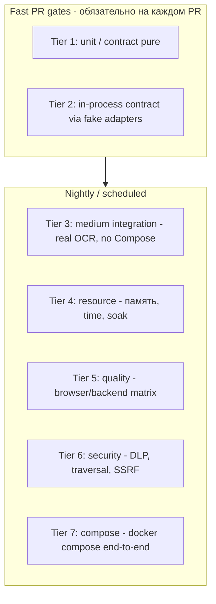
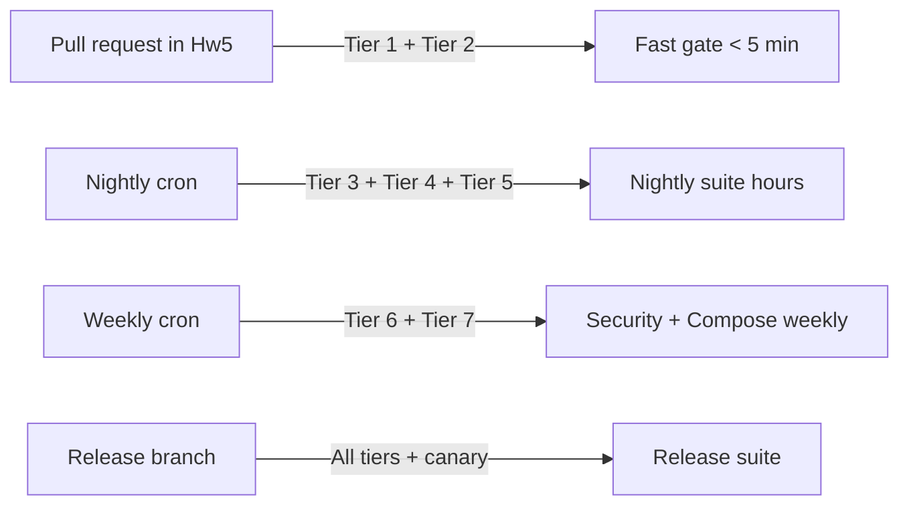

# Test Platform RFC для HW5

Дата: 2026-06-14
База: локальная ветка `Hw5` (НЕ `main`, НЕ `engine`)
Режим: architect / zoo code orchestration
Связанные документы: [`.zoo/plan.md`](../../plan.md:1), [`.zoo/.review-from-llm/TARGET_ARCHITECTURE.md`](TARGET_ARCHITECTURE.md:1), [`docs/ru/testing.md`](../../docs/ru/testing.md:1), [`docs/ru/architecture-limitations.md`](../../docs/ru/architecture-limitations.md:1)

> Этот RFC не меняет runtime OCR и не трогает `engine`-ветку. Все
> предложения ориентированы на `Hw5` и его локальные производные
> (`hw5-tests-*`, `hw5-cli-text-endpoint` и т. п.). Engine-фиксы,
> затрагивающие `pytesseract` / OpenCV / EasyOCR, остаются в
> `engine-descendant` и приходят обратно отдельным коммитом.

## 1. Проблема

Текущая тестовая база в `Hw5` смешивает три класса тестов в одном
«monolith suite»:

- **полезные contract tests**, проверяющие устойчивые границы
  (lifecycle задач, протокол worker'а, layout pipeline contracts,
  profile limits);
- **glue/smoke tests**, которые дёргают маршруты через
  monkeypatched `globalThis.fetch` и проверяют, что ответ «похож на
  правду»;
- **heavily mocked endpoint tests** уровня FastAPI, где
  `convert_bytes`/`iter_convert_bytes` подменены на `lambda`, и
  тест-фактически проверяет собственный stub.

Слабые места зафиксированы в [`.zoo/plan.md`](../../plan.md:38):

- `gateway/src/core/routes.test.ts` в основном glue/smoke, а не
  архитектурные контракты.
- `ocr/tests/test_main.py` слишком heavily mocked и часто
  тестирует monkeypatched service вместо боевых boundary.
- `testtables/` признан временным A/B corpus, а не фундаментом test
  platform.

Нужен risk-based test platform: разные tiers с разной скоростью,
изоляцией и владельцем, deterministic generators вместо гигантского
Git-corpus, fault injection на границах, и явное разделение
fast PR gates vs scheduled suites.

## 2. Цели

1. Дать каждому уровню архитектуры (contract, executor, transport,
   quality, resource, security, compose) свой собственный test tier
   с явным владельцем и SLA по времени.
2. Заменить «дёрнуть monkeypatched сервис и проверить JSON» на
   проверку фактических boundary: worker spawn, stream protocol,
   upload limits, fault injection.
3. Сделать generated fixtures детерминированной заменой ручного
   `testtables/` corpus, оставив `testtables/` как A/B материал.
4. Явно отделить fast PR gates (должны быть < 5 минут на одной
   машине) от scheduled suites (soak, GPU EasyOCR, large-image
   matrix).
5. Зафиксировать branch ownership: что живёт только в `Hw5`, что
   только в engine-ветке, что мигрирует.

## 3. Non-goals

- Не предлагать runtime-фиксы для OCR engine: `pytesseract`,
  OpenCV, EasyOCR, Tesseract.js — это `engine`-домен.
- Не вводить обязательный Redis/RabbitMQ для test platform.
- Не вводить «85–99.9% coverage» как KPI — coverage зависит от
  risk model, а не от метрики.
- Не превращать `testtables/` в канонический fixture source. Это
  A/B corpus.
- Не использовать remote live DOM сторонних сайтов как contract
  (в принципе см. [`TARGET_ARCHITECTURE.md`](TARGET_ARCHITECTURE.md:160)).
- Не вводить byte-identical паритет Browser OCR vs Backend OCR.

## 4. Risk model

`Hw5` делит тестируемые риски на пять осей:

| Ось риска | Что ломается | Где в коде |
| --- | --- | --- |
| **Contract** | Меняются request/response/event shape, отваливается resume, ломается cancel | `gateway/src/tasks/*`, `gateway/src/core/routes.ts`, `web/src/ocr/api-client.ts`, `ocr/app/routers/*` |
| **Quality** | Ломаются числа, текст, порядок строк, структура таблиц | `ocr/app/layout/*`, `ocr/app/engines/*`, `web/src/ocr/layout-pipeline.ts` |
| **Resource** | OOM на 80MP, temp file leak, decoded-pixel bomb, GPU VRAM | `ocr/app/services/convert_service.py`, `ocr/app/upload_limits.py`, `web/src/ocr/image-tiling.ts` |
| **Security** | Path traversal, SSRF, DLP leak в telemetry, prompt injection | `ocr/app/services/convert_service.py`, `web/src/ocr/llm-consent.ts`, `web/src/extension-core/*` |
| **Compose** | End-to-end: nginx ↔ gateway ↔ ocr, healthcheck, restart policy | `docker-compose.yml`, `scripts/smoke-compose.sh` |

Каждая ось получает свой tier, свой runner, своего владельца.

## 5. Tiers

### 5.1 Tier 1 — Unit / contract pure

- Время: секунды. Должен бежать первым на каждом PR.
- Стек: `node:test` для TS, `pytest` без сетевых и subprocess
  зависимостей для Python.
- Что входит:
  - типы и сериализаторы `ExtractionRequest/Event/Result/Error`;
  - инварианты layout contracts (см.
    [`ocr/tests/test_layout_pipeline_contracts.py`](../../ocr/tests/test_layout_pipeline_contracts.py:1));
  - profile allowlist invariants (см.
    [`web/src/ocr/pipeline-config.test.ts`](../../web/src/ocr/pipeline-config.test.ts:1));
  - всё, что не требует worker boundary, файловой системы и
    `globalThis.fetch`.
- Запрещено: monkeypatch `convert_bytes`/`iter_convert_bytes`,
  реальные HTTP-вызовы, реальный Poppler/pytesseract.

### 5.2 Tier 2 — In-process contract via fake adapters

- Время: минуты, но всё ещё в PR gate.
- Стек: `node:test` с fake `WorkerExecutor` / fake `fetch` /
  `monkeypatch` в pytest.
- Что входит:
  - `TaskService` lifecycle и cancel — см.
    [`gateway/src/tasks/task-service.test.ts`](../../gateway/src/tasks/task-service.test.ts:1);
  - `ProcessWorkerExecutor` protocol — см.
    [`gateway/src/tasks/process-worker.test.ts`](../../gateway/src/tasks/process-worker.test.ts:1);
  - browser layout pipeline over synthetic rasters — см.
    [`web/src/ocr/layout-pipeline.test.ts`](../../web/src/ocr/layout-pipeline.test.ts:1);
  - `mergeOcrTextChunks`, `image-tiling`, `api-client` protocol —
    см. [`web/src/ocr/*test*.ts`](../../web/src/ocr/);
  - generated media matrix (low-fidelity) — см.
    [`ocr/tests/test_generated_media_matrix.py`](../../ocr/tests/test_generated_media_matrix.py:1).
- Граница: разрешены fake executors, fake transport, in-memory
  queue. Запрещены реальные OCR-движки, реальная сеть, реальный
  Poppler.
- Текущий `routes.test.ts` и `test_main.py` целиком переезжают
  сюда, **но** из них удаляются glue/smoke, которые проверяют
  только «что endpoint вернул что-то похожее на JSON».

### 5.3 Tier 3 — Medium integration (real OCR, no Compose)

- Время: минуты–десятки минут. Scheduled, не PR.
- Стек: pytest + реальный backend, но без docker compose. Своя
  venv, свои шрифты, легковесный CI image
  (`docker/ocr.Dockerfile --target test`).
- Что входит:
  - реальный Tesseract на generated raster fixtures
    (см. [`ocr/tests/quality_fixtures.py`](../../ocr/tests/quality_fixtures.py:1));
  - реальный PDF spool + `pdf2image` smoke (см.
    [`ocr/tests/test_upload_processing.py`](../../ocr/tests/test_upload_processing.py:1));
  - `test_ocr_quality.py` на generated-фикстурах `eng` / `rus` /
    `chi_sim`;
  - browser Tesseract.js на generated-фикстурах, без Playwright —
    jsdom + worker mock.
- Граница: один процесс, контролируемые пути к `tesseract` /
  `pdftoppm`. Запрещено поднимать compose или ходить в сеть.

### 5.4 Tier 4 — Resource (память, время, soak)

- Время: часы. Scheduled nightly или weekly.
- Стек: `pytest` с memory profiler, Node `--max-old-space-size`
  wrappers, отдельный benchmark script.
- Что входит:
  - `image-tiling` matrix: от 1×1 до 50000×50000, проверка
    отсутствия pixel allocation до `_validate_decoded_image_size`;
  - long receipt / long screenshot soak (см. тест
    `test_generated_long_receipt_reaches_engine_as_bounded_segments` в
    [`ocr/tests/test_generated_media_matrix.py`](../../ocr/tests/test_generated_media_matrix.py:200));
  - PDF spool: размеры файлов у границ `OCR_MAX_UPLOAD_BYTES`,
    `OCR_MAX_PDF_PAGES`, `OCR_MAX_PDF_RENDER_DIMENSION`;
  - `TaskService` capacity, queue, cancel под нагрузкой
    (concurrency 1, 2, N workers, race cancel);
  - repeated-request soak (минимум N итераций, контроль RSS, см.
    [`docs/ru/architecture-limitations.md`](../../docs/ru/architecture-limitations.md:97)).
- Запрещено: мерять качество OCR в этом tier. Resource и Quality
  — разные оси.

### 5.5 Tier 5 — Quality matrix

- Время: часы. Scheduled.
- Стек: pytest + browser tesseract.js (через
  [`scripts/benchmark-browser-ocr.ts`](../../scripts/benchmark-browser-ocr.ts:1))
  + backend Tesseract / EasyOCR.
- Что входит:
  - generated fixtures по осям: язык (`eng`, `rus`, `chi_sim`),
    режим документа (table, receipt, multi-column, dense), DPI,
    поворот;
  - golden invariants: текст, цифры, пары строк, порядок,
    структура (см. [`TARGET_ARCHITECTURE.md`](TARGET_ARCHITECTURE.md:114));
  - Browser vs Backend сравнение **по контракту и метрикам**, а
    не по byte equality;
  - regression test для известных engine-дефектов — отдельный
    файл, помеченный `expected_failure` или с skipped-режимом
    до тех пор, пока engine-фикс не пришёл в `Hw5`.
- Этот tier получает отдельный runner, потому что именно тут
  сосредоточены «engine vs HW5» раздоры. Подробности см. § 8.

### 5.6 Tier 6 — Security

- Время: десятки минут. Scheduled.
- Что входит:
  - path traversal в PDF spool (см. тест
    `test_pdf_spool_ignores_traversal_filename_and_cleans_up_on_failure`
    в [`ocr/tests/test_generated_media_matrix.py`](../../ocr/tests/test_generated_media_matrix.py:179));
  - upload-limit обход (см.
    `test_convert_rejects_upload_over_configured_limit` в
    [`ocr/tests/test_main.py`](../../ocr/tests/test_main.py:254));
  - LLM consent gate (см.
    [`web/src/ocr/llm-consent.test.ts`](../../web/src/ocr/llm-consent.test.ts:1));
  - SSRF-фильтр на gateway (`/api/convert` URL handling);
  - DOM extractor allow/deny list (см.
    [`web/src/extension-core/*test*.ts`](../../web/src/extension-core/));
  - DLP redaction не должна портить canonical extraction
    result (см.
    [`TARGET_ARCHITECTURE.md`](TARGET_ARCHITECTURE.md:101));
  - malicious PDF / polyglot files: размер encoded мал,
    decoded огромен.
- Граница: tier проверяет, что security-политики соблюдаются
  кодом, **а не пишет DLP-правила**. Политики остаются
  самостоятельным RFC.

### 5.7 Tier 7 — Compose E2E

- Время: десятки минут. Scheduled.
- Стек: `docker compose up -d --build`,
  [`scripts/smoke-compose.sh`](../../scripts/smoke-compose.sh:1),
  curl/httpx против `http://nginx/api/health`, `/api/tasks`,
  `/api/tasks/:id/events`.
- Что входит:
  - happy path Hyprland:
    `image/png -> /api/tasks?sync=text -> text/plain`;
  - sync disconnect отменяет задачу и возвращает 499;
  - events stream reconnect с `Last-Event-ID`;
  - restart policy: убить ocr контейнер во время задачи,
    проверить recovery;
  - persistent health degradation: ocr контейнер падает →
    health endpoint отдаёт `degraded`.
- Граница: Compose-тесты работают поверх тех же contracts, что
  и Tier 2, **но добавляют реальную сеть, реальный shm,
  реальные resource budgets**.

## 6. Классификация существующих тестов

### 6.1 Контрактно-полезные (оставить и развивать)

| Файл | Роль | Tier |
| --- | --- | --- |
| [`gateway/src/tasks/task-service.test.ts`](../../gateway/src/tasks/task-service.test.ts:1) | lifecycle, cancel, queue, capacity | 2 |
| [`gateway/src/tasks/process-worker.test.ts`](../../gateway/src/tasks/process-worker.test.ts:1) | worker protocol, timeout, crash, malformed | 2 |
| [`gateway/src/tasks/input-storage.test.ts`](../../gateway/src/tasks/input-storage.test.ts:1) | upload boundary | 2 |
| [`gateway/src/core/handle.test.ts`](../../gateway/src/core/handle.test.ts:1) | request shape | 1 |
| [`gateway/src/core/node-adapter.test.ts`](../../gateway/src/core/node-adapter.test.ts:1) | backpressure adapter | 1 |
| [`gateway/src/cli/run.test.ts`](../../gateway/src/cli/run.test.ts:1) | CLI over extraction-client | 2 |
| [`gateway/src/cli/extraction-client.test.ts`](../../gateway/src/cli/extraction-client.test.ts:1) | CLI client | 2 |
| [`web/src/ocr/layout-pipeline.test.ts`](../../web/src/ocr/layout-pipeline.test.ts:1) | browser pipeline contract | 2 |
| [`web/src/ocr/layout-selectors.test.ts`](../../web/src/ocr/layout-selectors.test.ts:1) | browser selector | 1 |
| [`web/src/ocr/layout-stages.test.ts`](../../web/src/ocr/layout-stages.test.ts:1) | browser stages | 1 |
| [`web/src/ocr/layout-features.test.ts`](../../web/src/ocr/layout-features.test.ts:1) | browser features | 1 |
| [`web/src/ocr/pipeline-config.test.ts`](../../web/src/ocr/pipeline-config.test.ts:1) | profile allowlist | 1 |
| [`web/src/ocr/image-tiling.test.ts`](../../web/src/ocr/image-tiling.test.ts:1) | tiling boundary | 2 |
| [`web/src/ocr/merge-ocr-chunks.test.ts`](../../web/src/ocr/merge-ocr-chunks.test.ts:1) | merge invariants | 1 |
| [`web/src/ocr/api-client.test.ts`](../../web/src/ocr/api-client.test.ts:1) | stream / fallback / captive portal | 2 |
| [`web/src/ocr/base64-stream.test.ts`](../../web/src/ocr/base64-stream.test.ts:1) | stream integrity | 1 |
| [`web/src/ocr/llm-consent.test.ts`](../../web/src/ocr/llm-consent.test.ts:1) | consent gate | 6 |
| [`web/src/ocr/browser-image-preprocessor.test.ts`](../../web/src/ocr/browser-image-preprocessor.test.ts:1) | resize worker boundary | 2 |
| [`web/src/ocr/source-availability.test.ts`](../../web/src/ocr/source-availability.test.ts:1) | auto source selection | 1 |
| [`web/src/ocr/tesseract-worker-session.test.ts`](../../web/src/ocr/tesseract-worker-session.test.ts:1) | asset path normalization | 1 |
| [`web/src/ocr/browser-engine.ocr-test.ts`](../../web/src/ocr/browser-engine.ocr-test.ts:1) | browser OCR integration | 3 |
| [`ocr/tests/test_layout_pipeline_contracts.py`](../../ocr/tests/test_layout_pipeline_contracts.py:1) | profile + decision shapes | 1 |
| [`ocr/tests/test_layout_stages.py`](../../ocr/tests/test_layout_stages.py:1) | layout stage semantics | 1 |
| [`ocr/tests/test_layout_geometry.py`](../../ocr/tests/test_layout_geometry.py:1) | projection geometry | 1 |
| [`ocr/tests/test_preprocessing.py`](../../ocr/tests/test_preprocessing.py:1) | preprocessing primitives | 1 |
| [`ocr/tests/test_text_processing.py`](../../ocr/tests/test_text_processing.py:1) | text / merge / dedupe | 1 |
| [`ocr/tests/test_table_fixtures.py`](../../ocr/tests/test_table_fixtures.py:1) | table fixtures | 5 |
| [`ocr/tests/test_quality_metrics.py`](../../ocr/tests/test_quality_metrics.py:1) | metrics helpers | 5 |
| [`ocr/tests/test_document_templates.py`](../../ocr/tests/test_document_templates.py:1) | document template generators | 5 |
| [`ocr/tests/test_generated_media_matrix.py`](../../ocr/tests/test_generated_media_matrix.py:1) | raster variants + matrix | 2/4 |
| [`ocr/tests/test_upload_processing.py`](../../ocr/tests/test_upload_processing.py:1) | PDF spool + limits | 3/4 |
| [`ocr/tests/test_visual_mutations.py`](../../ocr/tests/test_visual_mutations.py:1) | visual mutation generators | 4 |
| [`ocr/tests/test_auto_engine.py`](../../ocr/tests/test_auto_engine.py:1) | auto engine selection | 3 |
| [`ocr/tests/test_pdf_progress.py`](../../ocr/tests/test_pdf_progress.py:1) | PDF progress reporting | 3 |

### 6.2 Glue/smoke (понизить или удалить)

| Файл | Что не так | Решение |
| --- | --- | --- |
| [`gateway/src/core/routes.test.ts`](../../gateway/src/core/routes.test.ts:1) | `globalThis.fetch` подменяется на синтетический NDJSON; проверяется «что endpoint вернул JSON», а не «что gateway сошёлся с TaskService». Реальные boundary — это `task-service.test.ts` + `process-worker.test.ts`. | Оставить 1–2 sanity-теста (например, что `route()` в принципе резолвит `/api/tasks` в `handleTaskApi()`), пометить как `// @smoke` и **не дублировать в них** lifecycle, capacity, cancel. |
| [`ocr/tests/test_main.py`](../../ocr/tests/test_main.py:1) | `monkeypatch.setattr(convert_service, "convert_bytes", ...)` тестирует сам stub. Контракты уже покрыты в `test_layout_pipeline_contracts.py` и unit-уровне `routers/`. | Оставить только health/probe/install edge cases (runtime flags, install job state), которые нельзя проверить вне FastAPI. Convert-тесты заменить на Tier 3/4 fixtures. |

### 6.3 Пробелы (нужны новые тесты)

- **Cancel race**: `service.cancel()` ровно в момент
  `executor.execute()` start, до первого `emit`. Сейчас
  покрыт только случай с `await new Promise`, но не
  `AbortSignal.aborted` race.
- **Events disconnect grace-cancel**: реализован в
  [`gateway/src/tasks/http-api.ts`](../../gateway/src/tasks/http-api.ts:1)
  (см. план, инкремент `hw5-events-grace-cancel`), но
  unit-тест в `routes.test.ts` это **smoke**; нужен отдельный
  тест на `TaskService` или `http-api` напрямую: reconnect
  в течение grace отменяет pending cancel, после истечения
  grace — отменяет terminal-cancelled-pending task.
- **Listing serializer**: `service.list()` возвращает
  records, но `routes.test.ts` проверяет только
  `state`/`limit` фильтры. Нужны тесты на сериализацию без
  file bytes (никаких `Uint8Array` или base64 в JSON).
- **Browser worker-pool concurrent leases**: см.
  [`web/src/ocr/tesseract-worker-session.test.ts`](../../web/src/ocr/tesseract-worker-session.test.ts:1)
  — есть базовые тесты, но нет stress-теста «N recognitions
  с разной длиной страниц».
- **PDF polyglot / decompression bomb**: см.
  [`docs/ru/architecture-limitations.md`](../../docs/ru/architecture-limitations.md:73),
  corpus пока не покрывает эти случаи.
- **Tier 5 metrics regression**: нужен baseline golden для
  `quality_metrics.py`, иначе metrics не «прибиты» к
  контракту.
- **Tier 6 SSRF через custom gateway URL**:
  `buildBackendGatewayCandidates` уже умеет принимать
  пользовательский URL — нужен negative test
  «не идём в `localhost`/metadata».
- **Tier 7 Compose restart policy**: `scripts/smoke-compose.sh`
  проверяет только `up` и `health`; нет сценария «убить ocr
  контейнер во время задачи».

## 7. Generated fixtures strategy

`testtables/` остаётся ручным A/B corpus. Test platform
строится поверх deterministic generators:

### 7.1 Уже есть в `Hw5`

- [`ocr/tests/generated_media.py`](../../ocr/tests/generated_media.py:1):
  `image_bytes`, `text_image_bytes`, `transparent_text_png_bytes`,
  `animated_gif_bytes`, `multipage_tiff_bytes`,
  `exif_rotated_jpeg_bytes`, `deterministic_mutations`.
- [`ocr/tests/document_templates.py`](../../ocr/tests/document_templates.py:1):
  document template generators для quality fixtures.
- [`ocr/tests/quality_fixtures.py`](../../ocr/tests/quality_fixtures.py:1):
  language/quality fixtures.
- [`ocr/tests/visual_mutations.py`](../../ocr/tests/visual_mutations.py:1):
  visual mutation primitives.
- Browser raster generator в
  [`web/src/ocr/layout-pipeline.test.ts`](../../web/src/ocr/layout-pipeline.test.ts:1):
  `threeColumnRaster()`, `whiteRaster()`.

### 7.2 Что добавить

1. **Fixture registry с seed'ами**: каждый generated fixture
   принимает `seed` (uint32) и пишет в meta «этот fixture
   собирается из seed X с версией генератора Y». Это позволяет
   воспроизводить падения в Tier 4/5.
2. **Matrix orchestrator** (Python): параметризованный runner,
   который принимает ось (`size`, `mode`, `format`,
   `rotation`, `dpi`, `language`) и собирает pytest-кейсы
   динамически. Сейчас часть матрицы уже есть в
   `test_generated_media_matrix.py` (`pytest.mark.parametrize`);
   нужно явно вынести в общий модуль, чтобы добавить оси без
   копипасты.
3. **Browser fixture parity**: у браузера есть только
   `threeColumnRaster`. Нужны генераторы:
   - dense receipt (1×N);
   - two-column with gutter drift;
   - rotated card;
   - one-pixel-wide screenshot (см.
     [`web/src/ocr/image-tiling.test.ts`](../../web/src/ocr/image-tiling.test.ts:51)).
4. **Fuzz layer поверх generated**: `deterministic_mutations`
   уже есть, нужно зафиксировать, что `RUN_GENERATED_FUZZ=1`
   поднимает count с 32 до 512 (см. строку
   `mutation_count = 512 if os.environ.get("RUN_GENERATED_FUZZ") == "1" else 32`
   в [`ocr/tests/test_generated_media_matrix.py`](../../ocr/tests/test_generated_media_matrix.py:111)).
5. **Testtables как Tier 5 input, а не Tier 1 input**:
   `testtables/` подключается только в nightly suite. В PR
   gates он не появляется. Это снимает нагрузку с
   детерминизма и оставляет corpus для сравнения
   браузер-vs-бэкенд.

### 7.3 Что НЕ делать

- Не коммитить готовые decompression bombs / огромные PDF в
  Git.
- Не использовать реальные сканы паспортов/чеков: для этого
  есть synthetic templates в `document_templates.py`.
- Не превращать `testtables/` в «канон»: он A/B corpus,
  и любой тест, опирающийся на конкретное имя файла из
  `testtables/`, должен быть помечен
  `requires_testtables_corpus` и не идти в PR gate.

## 8. Fault injection

Fault injection живёт в Tier 2 (in-process fake) и Tier 7
(real compose). Tier 4/5 используют generators, чтобы
детерминированно воспроизводить «сломанные» входы.

### 8.1 Уже есть частично

- Worker protocol malformed/oversized — см.
  [`gateway/src/tasks/process-worker.test.ts`](../../gateway/src/tasks/process-worker.test.ts:49).
- Worker crash → typed error `WORKER_FAILED`, partial result
  сохраняется — см.
  [`gateway/src/tasks/task-service.test.ts`](../../gateway/src/tasks/task-service.test.ts:84).
- Task queue capacity overflow — `TaskCapacityError` — см.
  [`gateway/src/tasks/task-service.test.ts`](../../gateway/src/tasks/task-service.test.ts:105).
- Malformed media payload — см.
  [`ocr/tests/test_generated_media_matrix.py`](../../ocr/tests/test_generated_media_matrix.py:103).
- Deterministic binary mutations → outcomes `{decoded, rejected}`
  без native crash — см.
  [`ocr/tests/test_generated_media_matrix.py`](../../ocr/tests/test_generated_media_matrix.py:108).
- Backend timeout через `time.sleep` + `httpx` — см.
  `test_convert_does_not_block_health_endpoint` в
  [`ocr/tests/test_main.py`](../../ocr/tests/test_main.py:215).

### 8.2 Что добавить

| Категория | Сценарий | Где живёт |
| --- | --- | --- |
| Timeout | Worker зависает, `ProcessWorkerExecutor` принудительно убивает по `timeoutMs` | уже есть в `process-worker.test.ts`, но нет варианта «worker убит после page 2, partial сохраняется» |
| Disconnect | Клиент отвалился во время `runNext()`, executor получает abort | `task-service.test.ts` покрывает running; нужен queued-в-running race |
| Partial stream | `iter_convert_bytes` отдал page 1/2, потом `RuntimeError` | нужно проверить, что gateway отдаёт terminal error, а не зависает |
| Worker crash | `process.kill(pid, 'SIGKILL')` | уже есть; нужен вариант «worker kill посреди progress event» |
| Disk full | `tmp_path` заполнен, pdf spool падает | сейчас не покрыт; добавить в Tier 4 |
| Malformed media | Полиглот PDF/JPEG, обрезанный PNG, пустой input | частично покрыт в `test_generated_media_matrix.py` |
| Stale protocol | Worker шлёт event `version: 99` | нужно покрыть в `process-worker.test.ts` |
| GPU OOM | EasyOCR падает по VRAM | не покрыт; это engine-зона, но fault-injection contract нужен в `engines/auto_engine.py` |
| LLM timeout | `fetch` к провайдеру зависает | `llm-consent.test.ts` есть, но нет теста «consents yes, fetch never resolves» |

## 9. Branch ownership

Этот раздел синхронизирован с
[`TARGET_ARCHITECTURE.md`](TARGET_ARCHITECTURE.md:130), но
специализирован под test-only и engine-related repro tests.

### 9.1 Что живёт только в `Hw5`

- Все Tier 1 / Tier 2 тесты (см. § 5.1, § 5.2).
- Test-only коммиты:
  `test: ...`, `chore(tests): ...`,
  `test(contract): ...`, `test(quality): ...`.
- Generated fixture orchestrator (§ 7).
- Скрипты запуска tiers: `scripts/run-tier-1.sh`,
  `scripts/run-tier-3.sh`, `scripts/run-resource-tests.sh` (уже
  есть, нужно явно типизировать).
- Smoke-тесты Tier 7 (compose), которые не меняют runtime.
- Repro-тесты для **архитектурных** дефектов (lifecycle,
  cancel, transport, security policy).

### 9.2 Что живёт только в `engine-descendant`

- Repro-тесты для **OCR-engine** дефектов (Tesseract
  segmentation, EasyOCR memory profile, OpenCV dewarp, layout
  selector math).
- Любые изменения в `ocr/app/engines/*`,
  `ocr/app/layout/*`, `ocr/app/preprocessing.py` —
  сопровождаются engine-тестами, **отдельным коммитом** от
  test-only изменений.
- `RUN_GENERATED_FUZZ=1` матрица, которая требует реального
  OCR движка.

### 9.3 Цикл миграции repro-теста

Соответствует [`TARGET_ARCHITECTURE.md`](TARGET_ARCHITECTURE.md:139):

1. В `Hw5` появляется сжатый repro-тест, помеченный
   `@pytest.mark.xfail(reason="engine: <короткий id>")` или
   `test.skip(...)` в TS. Этот коммит — test-only.
2. От `Hw5` создаётся локальная ветка
   `hw5-engine/<problem>`.
3. В ней делается engine-фикс, **отдельным коммитом**.
4. После проверки ветка локально возвращается в `Hw5`, repro
   переводится из `xfail` в активный тест, отдельным
   коммитом.
5. В `main` изменения попадают **только** после отдельной
   синхронизации пользователем.

### 9.4 Граница: что нельзя делать в test-only коммите

- Менять runtime OCR (engine fix).
- Менять production-код `gateway/src/tasks/*` или
  `ocr/app/*`, кроме случая, когда код **специально
  разработан** как testability hook (например,
  `resetTaskApiForTests()`).
- Менять `main`.
- Переносить тесты из `engine` в `Hw5` без активного
  repro-коммита в `Hw5`.

## 10. CI / runner layout

### 10.1 PR gate (быстрый)

- Запускает только Tier 1 + Tier 2.
- Жёсткий лимит: 5 минут wall clock на CI runner.
- Запрещено: реальный Tesseract, реальный Poppler,
  `testtables/`, GPU.
- Этот gate должен быть зелёным до любого merge в `Hw5`.

### 10.2 Nightly

- Tier 3 (medium integration), Tier 4 (resource), Tier 5
  (quality matrix) на `RUN_GENERATED_FUZZ=1`.
- Время: часы, отдельный runner.
- Регрессии оформляются как test-only коммиты в `Hw5`.

### 10.3 Weekly

- Tier 6 (security) + Tier 7 (compose E2E).
- Compose-сценарии: `up` + happy path + restart policy +
  health degradation.

### 10.4 Release

- Все tiers + canary subset `testtables/`.
- Это A/B замер browser vs backend на ручном corpus; **не
  блокирует** PR, но сигнализирует качество.

## 11. План первого инкремента (HW5-only, без runtime OCR)

Все шаги — test-only коммиты, в локальной производной ветке
от `Hw5`, например `hw5-test-platform-rfc-impl`.

1. **Smoke-маркировка**: ввести `// @smoke` маркер (Python:
   pytest collection marker) и пометить им «лишние» тесты в
   `routes.test.ts` и `test_main.py`. Они остаются, но
   отдельный runner `npm run test:smoke` не подменяет
   Tier 1/2.
2. **Tier runner scripts**: добавить
   `scripts/test-tier-1.sh`, `scripts/test-tier-2.sh`,
   `scripts/test-tier-3.sh`, `scripts/test-tier-4.sh`,
   `scripts/test-tier-5.sh`, `scripts/test-tier-6.sh`,
   `scripts/test-tier-7.sh`. Скрипты вызывают уже существующие
   команды из [`docs/ru/testing.md`](../../docs/ru/testing.md:1)
   с правильными env vars.
3. **Fixture registry seed**: добавить `seed` и
   `generator_version` в generated fixtures. Это позволит
   в Tier 4/5 получать воспроизводимые падения.
4. **Fault-injection coverage**: добавить недостающие кейсы
   из § 8.2: partial stream, disk full, stale protocol, LLM
   timeout. Без изменений runtime OCR, только fake executors.
5. **Cancel race + events grace-cancel unit tests**: поднять
   `grace-cancel` поведение из smoke-теста в
   `routes.test.ts` до настоящего unit-теста против
   `handleTaskApi()` или `TaskService` + fake executor.
6. **Listing serializer test**: убедиться, что
   `service.list()` сериализует задачи без file bytes (никакого
   `Uint8Array` / base64). Защита от регрессии.
7. **Tier 7 compose restart policy**: добавить сценарий в
   [`scripts/smoke-compose.sh`](../../scripts/smoke-compose.sh:1)
   или его преемника: `kill ocr` во время задачи → проверка,
   что `task` либо завершилась `failed`, либо `health`
   отдаёт `degraded`, а gateway не виснет.
8. **Coverage quality_metrics golden**: зафиксировать
   baseline для [`ocr/tests/quality_metrics.py`](../../ocr/tests/quality_metrics.py:1),
   чтобы Tier 5 не дрейфовал без контроля.

### 11.1 Фактический первый инкремент

- Smoke-классификация сделана комментариями в `routes.test.ts` и
  `test_main.py`; pytest marker не добавлялся, потому что markers в текущем
  `pyproject.toml` не настроены.
- Вместо семи пустых tier-оболочек добавлены два рабочих entrypoint:
  `scripts/run-contract-tests.sh` и `scripts/run-smoke-tests.sh`. Nightly,
  resource, quality, security и Compose команды остаются отдельными
  существующими runner-ами.
- Generated registry фиксирует уникальные IDs, seeds, категории и expected
  invariants без `testtables`. Поле `generator_version` остаётся следующим
  расширением registry.
- Добавлены watcher cleanup, file-safe listing serialization, truncated
  partial stream, stale protocol event и bounded stderr tail. Disk write
  failure уже покрыт `input-storage.test.ts`; LLM timeout остаётся gap.
- Compose restart policy и `quality_metrics` golden в этот инкремент не входят
  и остаются отдельными Tier 7 / Tier 5 задачами.

## 12. План второго инкремента (engine-зона, через `engine-descendant`)

Эти шаги **не** делаются в `Hw5` напрямую. Они идут в
локальной ветке от `engine`, с возвратом отдельным коммитом.

1. Engine-фиксы для repro-тестов, накопленных в `Hw5` через
   `xfail` маркеры.
2. EasyOCR GPU OOM fault injection.
3. Tesseract.js worker-pool stress-тест в реальном Chromium
   (Playwright) — отдельный runner.

## 13. Явные TODO / next steps

| # | Действие | Ветка | Tier | Зависимости |
| --- | --- | --- | --- | --- |
| T1 | Пометить smoke-теги, убрать дублирующие lifecycle/cancel кейсы из `routes.test.ts` | `hw5-test-platform-rfc-impl` | 2 | — |
| T2 | Добавить tier runner scripts (§ 10) | `hw5-test-platform-rfc-impl` | — | T1 |
| T3 | Seed/version в generated fixtures | `hw5-test-platform-rfc-impl` | 4/5 | — |
| T4 | Cancel race + grace-cancel unit tests (вытащить из smoke) | `hw5-test-platform-rfc-impl` | 2 | T1 |
| T5 | Listing serializer test (no file bytes) | `hw5-test-platform-rfc-impl` | 2 | — |
| T6 | Fault-injection: partial stream, stale protocol, LLM timeout | `hw5-test-platform-rfc-impl` | 2/6 | — |
| T7 | Compose restart policy smoke | `hw5-test-platform-rfc-impl` | 7 | T2 |
| T8 | Baseline quality_metrics golden | `hw5-test-platform-rfc-impl` | 5 | — |
| T9 | `RUN_GENERATED_FUZZ=1` зафиксировать в nightly workflow | `hw5-test-platform-rfc-impl` | 4 | T2, T3 |
| T10 | Browser fixture parity (receipt, gutter-drift, rotated card) | `hw5-test-platform-rfc-impl` | 2/5 | T3 |
| T11 | SSRF negative test для `buildBackendGatewayCandidates` | `hw5-test-platform-rfc-impl` | 6 | — |
| T12 | Engine: EasyOCR GPU OOM fault | `engine-descendant` | 4/5 | repro-тест в `Hw5` |
| T13 | Engine: Tesseract.js stress в Playwright | `engine-descendant` | 5 | repro-тест в `Hw5` |
| T14 | Пересмотреть `docs/ru/testing.md` под новые tier scripts | `hw5-test-platform-rfc-impl` | — | T2 |

## 14. Сводка ключевых решений

- `testtables/` — A/B corpus, **не** test platform. Он
  подключается только в Tier 5/7 и никогда в PR gate.
- `gateway/src/core/routes.test.ts` и `ocr/tests/test_main.py`
  переводятся в режим smoke + минимальные unit-кейсы. Их
  contract-роль закрывается `task-service.test.ts`,
  `process-worker.test.ts`, `test_layout_pipeline_contracts.py`
  и `web/src/ocr/*-pipeline*.test.ts`.
- Tier 1 + Tier 2 — обязательный PR gate, < 5 минут.
- Tier 3 / Tier 4 / Tier 5 — nightly, hours.
- Tier 6 / Tier 7 — weekly, security + compose.
- Fault injection: in-process fake на Tier 2, real compose
  на Tier 7, generated fuzz на Tier 4.
- Repro-тесты для engine-дефектов живут в `Hw5` как
  `xfail`/skip, мигрируют в `engine-descendant` через
  `hw5-engine/<problem>`, возвращаются активными отдельным
  коммитом.
- `main` остаётся чистой точкой синхронизации, никаких
  test-only или engine-only коммитов туда не идёт без
  пользователя.
- Этот RFC не предлагает runtime-фиксов OCR и не меняет
  поведение `pytesseract` / OpenCV / EasyOCR.
