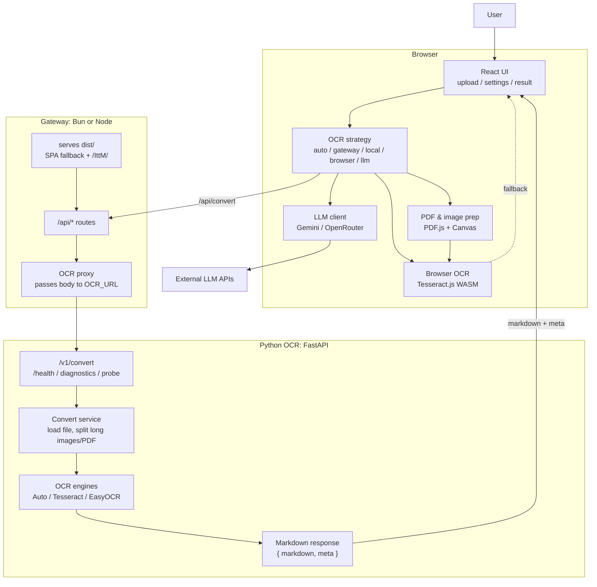

Веб-приложение для конвертации длинных скриншотов экрана в Markdown

## [Запуск](https://ai-paca.github.io/IttM/)

```bash
bash run.sh
```

_(Сервер запустится на :3000)_

Если `3000` или `8000` заняты, локальные скрипты выбирают ближайшие свободные host-порты и печатают итоговые URL.

Для GitHub Pages сборка использует `VITE_BASE_PATH=/IttM/`; локальный `run.sh` собирает bundle с `VITE_BASE_PATH=/`, чтобы assets грузились с localhost без префикса репозитория.

`run.sh` рассчитан на слабую VPS: по умолчанию ставит только легкие runtime-зависимости из `ocr/requirements-light.txt`, не запускает тесты, не трогает Docker и не ставит PyTorch/EasyOCR. Тяжелый OCR включается отдельно через кнопку установки в UI или явно:

```bash
INSTALL_EASYOCR=1 bash run.sh
```

Если `dist/` уже собран, `run.sh` переиспользует его для быстрого рестарта. Для пересборки frontend:

```bash
FORCE_BUILD=1 bash run.sh
```

### Режимы запуска

- **GitHub Pages**: статический frontend, распознавание через browser OCR и LLM/API-режимы при доступности.
- **Bun local**: легкий gateway adapter без тяжелого Node-сервера; обычный `run.sh` не гоняет тесты и не ставит EasyOCR/PyTorch.
- **Node gateway**: основной production-friendly режим для Cloud Run, AI Studio, canvas/hosted-сред и локального `node`.
- **Local Python OCR**: FastAPI backend с Tesseract/EasyOCR за gateway.
- **Hybrid local+node/bun**: frontend/gateway локально, OCR backend отдельно через `OCR_URL`.

## CI и базовые проверки

Локально:

```bash
bash debug.sh
```

Быстро без Docker/act:

```bash
bash debug.sh --no-docker --no-act
```

Полная очистка Docker-кэшей включается только явно:

```bash
bash debug.sh --clean
```

Если Docker спотыкается из-за корпоративного firewall/daemon state, `debug.sh` вызывает `scripts/notify-docker-restart.sh`: он подает звук, показывает уведомление и ждёт ручного рестарта Docker.

Docker Compose не требует свободных `3000`/`8000`: `debug.sh` выставляет `GATEWAY_HOST_PORT` и `OCR_HOST_PORT` динамически. Для ручного запуска можно задать их явно:

```bash
GATEWAY_HOST_PORT=3001 OCR_HOST_PORT=8001 docker compose up --build
```

Основные команды, которые повторяет GitHub Actions:

```bash
npm ci
npm run format:check
npm run lint
npm test
npm run build
python -m pip install -r ocr/requirements-ci.txt
python -m pytest ocr/tests -q
RUN_OCR_QUALITY=1 python -m pytest ocr/tests/test_ocr_quality.py -q
npm run test:ocr:browser
```

Workflow `.github/workflows/tests.yml` содержит быстрые frontend/gateway/Python проверки и отдельный тяжелый OCR quality job с `chi_sim+eng+rus`, Tesseract language packs и Noto CJK fonts.

## Выбор стратегий OCR (в UI)

Выбор OCR - это часть логики браузерного UI, а не отдельный сервис.

- **Auto**: если diagnostics уже видит offline backend, сразу выбирает browser OCR; иначе пробует `/api/convert` и при ошибке переключается на browser OCR.
- **Gateway / Local Tesseract / Local EasyOCR**: все идут через `/api/convert`; локальные режимы только добавляют `engine_type=tesseract|easyocr`.
- **Browser Engine**: полностью работает в браузере через PDF.js/Canvas и Tesseract.js WASM.
- **LLM Cloud API**: браузер напрямую вызывает Gemini или OpenRouter по ключу пользователя.

## Архитектура проекта

Архитектура держится на трех runtime-границах: браузер, gateway и Python OCR. Gateway - единственная публичная серверная точка входа; Python OCR спрятан за `OCR_URL`. `auto` - это политика выбора внутри UI, а не отдельный backend-компонент.



<details>
<summary>Границы файлов</summary>

```text
web/src/
├─ App.tsx                  # верхний state: файл, режим OCR, diagnostics, theme
├─ ui/*                     # только UI-поверхности: header, sidebar, upload, loading, reading
├─ ocr/use-extraction.ts    # выбор OCR-пути, fallback, cancel/resume
├─ ocr/api-client.ts        # /api запросы, custom gateway URL, нормализация ошибок
├─ ocr/browser-engine.ts    # Tesseract.js WASM worker и профиль ресурсов
├─ ocr/llm-client.ts        # прямые запросы Gemini/OpenRouter
├─ ocr/file-utils.ts        # проверка файлов, browser diagnostics, image helpers
├─ ocr/pdf-text.ts          # слияние native PDF text и OCR-слоя
└─ lib/pdf-parser.ts        # PDF.js: чтение текста, рендер страниц в Canvas
```

```text
gateway/src/
├─ adapters/bun.ts          # Bun runtime adapter
├─ adapters/node.ts         # Node runtime adapter
├─ core/handle.ts           # static dist/, SPA fallback, /IttM/ prefix
├─ core/routes.ts           # /api/* маршруты
└─ clients/ocrClient.ts     # proxy в Python OCR по OCR_URL
```

```text
ocr/app/
├─ main.py                  # FastAPI app и подключение routers
├─ routers/*                # health, diagnostics, convert, probe, install
├─ services/convert_service.py
│                           # загрузка файла, split/dedupe, выбор engine
├─ engines/*                # OcrEngine, Tesseract, EasyOCR, Auto, Stub
├─ chunking/*               # разрезание длинных изображений и дедупликация
└─ formatting/*             # финальный Markdown
```

</details>

<details>
<summary>Задания курса</summary>

<table style="width:100%; border-collapse: collapse; margin-top: 12px;">
  <thead>
    <tr>
      <th style="padding: 12px; text-align: left; border: 1px solid rgba(0,0,0,0.2);">Задание</th>
      <th style="padding: 12px; text-align: left; border: 1px solid rgba(0,0,0,0.2);">Дедлайн</th>
      <th style="padding: 12px; text-align: left; border: 1px solid rgba(0,0,0,0.2);">4/10</th>
      <th style="padding: 12px; text-align: left; border: 1px solid rgba(0,0,0,0.2);">6/10</th>
      <th style="padding: 12px; text-align: left; border: 1px solid rgba(0,0,0,0.2);">8/10</th>
      <th style="padding: 12px; text-align: left; border: 1px solid rgba(0,0,0,0.2);">10/10</th>
    </tr>
  </thead>
  <tbody>
    <tr>
      <td style="background-color: #238636; color: white; padding: 12px; border: 1px solid rgba(0,0,0,0.2);">Репозиторий и описание проекта</td>
      <td style="background-color: #238636; color: white; padding: 12px; border: 1px solid rgba(0,0,0,0.2);">01.05.2026</td>
      <td style="background-color: #238636; color: white; padding: 12px; border: 1px solid rgba(0,0,0,0.2);">Есть репозиторий и README, но описание формальное/очень слабое</td>
      <td style="background-color: #238636; color: white; padding: 12px; border: 1px solid rgba(0,0,0,0.2);">Есть PR + README с понятной идеей проекта</td>
      <td style="padding: 12px; border: 1px solid rgba(0,0,0,0.2);">Есть ≥3 осмысленных комментария + студент отвечает на них</td>
      <td style="padding: 12px; border: 1px solid rgba(0,0,0,0.2);">README структурирован (цель, функционал, стек, планы), комментарии учтены и внесены правки</td>
    </tr>
    <tr>
      <td style="background-color: #238636; color: white; padding: 12px; border: 1px solid rgba(0,0,0,0.2);
      ">Рабочее веб-приложение — UI + backend с REST API</td>
      <td style="background-color: #238636; color: white; padding: 12px; border: 1px solid rgba(0,0,0,0.2);">01.05.2026</td>
      <td style="background-color: #238636; color: white; padding: 12px; border: 1px solid rgba(0,0,0,0.2);">Код есть, но не запускается или не работает</td>
      <td style="background-color: #238636; color: white; padding: 12px; border: 1px solid rgba(0,0,0,0.2);">Приложение запускается и выполняет базовую функцию</td>
      <td style="background-color: #238636; color: white; padding: 12px; border: 1px solid rgba(0,0,0,0.2);">Код структурирован (разделение логики, читаемость)</td>
      <td style="background-color: #238636; color: white; padding: 12px; border: 1px solid rgba(0,0,0,0.2);">Есть инструкции запуска + обработка ошибок + минимальная архитектура</td>
    </tr>
    <tr>
      <td style="background-color: #238636; color: white; padding: 12px; border: 1px solid rgba(0,0,0,0.2);">CI и базовые проверки</td>
      <td style="background-color: #238636; color: white; padding: 12px; border: 1px solid rgba(0,0,0,0.2);">08.05.2026</td>
      <td style="background-color: #238636; color: white; padding: 12px; border: 1px solid rgba(0,0,0,0.2);">CI есть, но работает нестабильно</td>
      <td style="background-color: #238636; color: white; padding: 12px; border: 1px solid rgba(0,0,0,0.2);">CI запускается и выполняет хотя бы одну проверку</td>
      <td style="background-color: #238636; color: white; padding: 12px; border: 1px solid rgba(0,0,0,0.2);">Добавлены линтеры/форматирование</td>
      <td style="padding: 12px; border: 1px solid rgba(0,0,0,0.2);">CI блокирует merge при ошибках + понятная структура pipeline</td>
    </tr>
    <tr>
      <td style="padding: 12px; border: 1px solid rgba(0,0,0,0.2);">Контейнеризация</td>
      <td style="padding: 12px; border: 1px solid rgba(0,0,0,0.2);">15.05.2026</td>
      <td style="padding: 12px; border: 1px solid rgba(0,0,0,0.2);">Dockerfile есть, но не собирается</td>
      <td style="padding: 12px; border: 1px solid rgba(0,0,0,0.2);">Контейнер собирается и приложение запускается</td>
      <td style="padding: 12px; border: 1px solid rgba(0,0,0,0.2);">Корректная структура Dockerfile (слои, зависимости)</td>
      <td style="padding: 12px; border: 1px solid rgba(0,0,0,0.2);">Минимизированный образ + инструкции запуска</td>
    </tr>
    <tr>
      <td style="background-color: #238636; color: white; padding: 12px; border: 1px solid rgba(0,0,0,0.2);">Тестирование</td>
      <td style="background-color: #238636; color: white; padding: 12px; border: 1px solid rgba(0,0,0,0.2);">22.05.2026</td>
      <td style="background-color: #238636; color: white; padding: 12px; border: 1px solid rgba(0,0,0,0.2);">Тесты есть, но не работают</td>
      <td style="background-color: #238636; color: white; padding: 12px; border: 1px solid rgba(0,0,0,0.2);">Есть рабочие тесты</td>
      <td style="background-color: #d4a017; color: white; padding: 12px; border: 1px solid rgba(0,0,0,0.2);">Покрыт основной функционал</td>
      <td style="background-color: #d4a017; color: white; padding: 12px; border: 1px solid rgba(0,0,0,0.2);">Несколько типов тестов + интеграция в CI</td>
    </tr>
    <tr>
      <td style="padding: 12px; border: 1px solid rgba(0,0,0,0.2);">Статический анализ безопасности</td>
      <td style="padding: 12px; border: 1px solid rgba(0,0,0,0.2);">29.05.2026</td>
      <td style="padding: 12px; border: 1px solid rgba(0,0,0,0.2);">Инструмент подключен формально</td>
      <td style="padding: 12px; border: 1px solid rgba(0,0,0,0.2);">Анализ запускается и показывает результаты</td>
      <td style="padding: 12px; border: 1px solid rgba(0,0,0,0.2);">Найденные проблемы исправлены</td>
      <td style="padding: 12px; border: 1px solid rgba(0,0,0,0.2);">Интеграция в CI + осмысленный разбор issues</td>
    </tr>
    <tr>
      <td style="padding: 12px; border: 1px solid rgba(0,0,0,0.2);">Композиционный анализ (SCA)</td>
      <td style="padding: 12px; border: 1px solid rgba(0,0,0,0.2);">05.06.2026</td>
      <td style="padding: 12px; border: 1px solid rgba(0,0,0,0.2);">Инструмент запущен без понимания</td>
      <td style="padding: 12px; border: 1px solid rgba(0,0,0,0.2);">Получен SBOM или отчет</td>
      <td style="padding: 12px; border: 1px solid rgba(0,0,0,0.2);">Найдены и объяснены уязвимости</td>
      <td style="padding: 12px; border: 1px solid rgba(0,0,0,0.2);">Предложены или применены способы устранения</td>
    </tr>
    <tr>
      <td style="padding: 12px; border: 1px solid rgba(0,0,0,0.2);">Отчетность и документация</td>
      <td style="padding: 12px; border: 1px solid rgba(0,0,0,0.2);">05.06.2026</td>
      <td style="padding: 12px; border: 1px solid rgba(0,0,0,0.2);">Отчет есть, но поверхностный</td>
      <td style="padding: 12px; border: 1px solid rgba(0,0,0,0.2);">Описаны основные этапы разработки</td>
      <td style="padding: 12px; border: 1px solid rgba(0,0,0,0.2);">Структурированный документ с примерами</td>
      <td style="padding: 12px; border: 1px solid rgba(0,0,0,0.2);">Полноценная документация уровня «передать другому разработчику»</td>
    </tr>
  </tbody>
</table>

**Правила курса:**

- Оценка за ДЗ: 0–10 баллов
- За каждую полную неделю опоздания −1 балл
- Для оценки 9–10 требуются дополнительные задания и устный экзамен

</details>

---

<details>
<summary>Общие требования к коду</summary>

- Код должен быть читаемым и поддерживаемым
- Соблюдать стайлгайд выбранного языка
- Использовать стандартные инструменты управления зависимостями

<details>
<summary>Управление зависимостями по языкам</summary>

| Язык                 | Файл зависимостей                                                                                             | Инструмент     |
| -------------------- | ------------------------------------------------------------------------------------------------------------- | -------------- |
| Python               | `requirements-light.txt` для `run.sh`, `requirements-ci.txt` для проверок, `requirements.txt` для полного OCR | pip            |
| JavaScript / Node.js | `package.json`                                                                                                | npm / yarn     |
| PHP                  | `composer.json`                                                                                               | Composer       |
| Ruby                 | `Gemfile`                                                                                                     | Bundler        |
| Java / Kotlin        | `pom.xml` / `build.gradle`                                                                                    | Maven / Gradle |
| Rust                 | `Cargo.toml`                                                                                                  | Cargo          |
| Go                   | `go.mod`                                                                                                      | Go Modules     |

</details>
</details>
