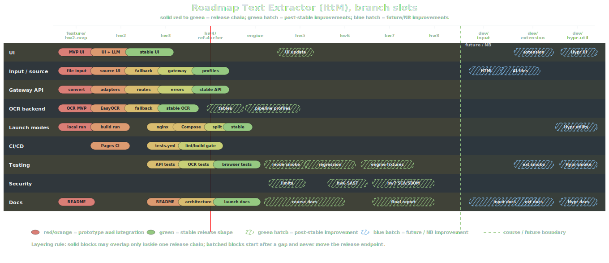
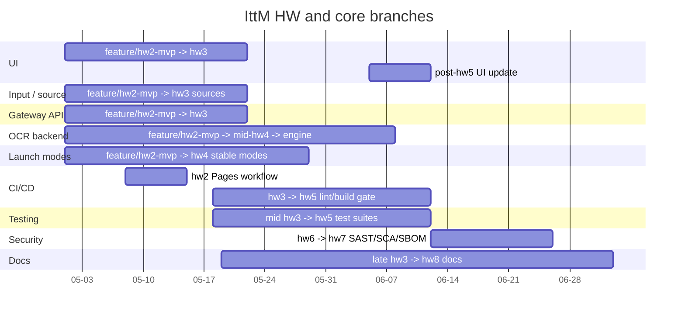
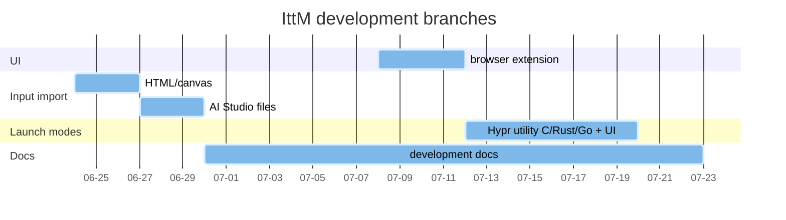

Веб-приложение для конвертации длинных скриншотов в Markdown

## Быстрый старт

### Docker

Windows PowerShell:

```powershell
docker compose up -d; $url = "http://" + (docker compose port nginx 80).Trim(); Start-Process $url; $url
```

Linux/macOS:

```bash
docker compose up -d && url="http://$(docker compose port nginx 80)" && (xdg-open "$url" >/dev/null 2>&1 || open "$url" >/dev/null 2>&1 || cmd.exe /C start "" "$url" >/dev/null 2>&1 || true) && printf '%s\n' "$url"
```
<details>
<summary>Решение проблем</summary>
По умолчанию используется порт 3000. Если он занят, адрес переопределяется автоматически, фактический адрес:

```bash
docker compose port nginx 80
```
Проверить backend через nginx:

```bash
curl -fsS "http://$(docker compose port nginx 80)/api/health"
```

Логи:
```bash
docker compose logs -f
```

Если Docker падает на DNS или registry, попробуйте перезапустить Docker daemon:
```bash
sudo systemctl restart docker
```
</details>

## Функции

- Распознавание текста из изображений, длинных скриншотов и PDF.
- Вывод результата в Markdown.
- Browser OCR для lite-сценария без backend OCR.
- Server OCR через FastAPI backend.
- LLM-режимы для постобработки результата.

## Режимы работы

| Режим | Целевая среда | Команда | Что запускается |
| --- | --- | --- | --- |
| Docker | Win 10/11, Linux, macOS, VPS | `docker compose up -d` | nginx публикуется наружу; gateway и OCR остаются внутри Compose-сети |
| Local host | Linux workstation | `bash scripts/run-local.sh` | Bun gateway, Python venv, Tesseract и Poppler на host-системе |
| Lite static | [GitHub Pages](https://ai-paca.github.io/IttM/), статический хостинг, слабый VPS, база для browser extension | `bash scripts/build-lite.sh` | статический frontend в `dist/`, browser OCR и внешние LLM-режимы |

<details>
<summary>Приватность обработки</summary>

| Режим в UI | Где обрабатывается файл | Что сохраняется приложением | Когда файл уходит наружу |
| --- | --- | --- | --- |
| Auto (Fallback) | По очереди: Cloud OCR, Local Gateway, Browser Engine | Выбранный файл держится в памяти вкладки; выбранный режим может храниться в cookie при включенном remember | Когда выбранный fallback дошел до Cloud OCR или custom gateway |
| Gateway API | Текущий Gateway или указанный endpoint | Gateway не пишет файл в базу; OCR создает временный файл и удаляет его после ответа | Когда endpoint указывает не на ваш локальный Docker/host, а на внешний сервер |
| Browser Engine | В памяти вкладки браузера | Документ не пишется в базу; `localStorage` хранит только тему интерфейса; браузер может кэшировать OCR-ассеты Tesseract.js | Не уходит из браузера |
| Local Tesseract | Python OCR API в вашем Docker или Local host | OCR создает временный файл внутри контейнера или системного temp-каталога и удаляет его после ответа | Не уходит на сторонний сервис |
| Local EasyOCR | Python OCR API в вашем Docker или Local host | OCR создает временный файл; EasyOCR пакеты/модели могут храниться в Docker volume или host-окружении | Не уходит на сторонний сервис |
| LLM Cloud API | Gemini или OpenRouter | Приложение само не пишет LLM key в `localStorage`, cookie или browser cache; менеджер паролей браузера может предложить сохранить поле по настройкам пользователя | Документ или страницы PDF отправляются во внешний AI API; проект не отвечает за то, что пользователь туда отправил |

</details>

<details>
<summary>Local host runtime: зависимости и запуск</summary>

Этот режим нужен для host-системы, где OCR-зависимости ставятся напрямую в окружение, без Docker-изоляции.

Версии: Node.js `22`, Python `3.10`, Bun для установки JS-зависимостей.

Зависимости проекта описаны в [package.json](./package.json), [ocr/requirements-light.txt](./ocr/requirements-light.txt) и [docker/ocr.Dockerfile](./docker/ocr.Dockerfile).

Системные OCR-пакеты для Ubuntu/Debian:

```bash
sudo apt update && sudo apt install -y tesseract-ocr tesseract-ocr-eng tesseract-ocr-rus tesseract-ocr-chi-sim poppler-utils
```

JS-зависимости:

```bash
bun install
```

Python-зависимости:

```bash
bash scripts/install-local-python.sh
```

Локальный запуск:

```bash
bash scripts/run-local.sh
```

Адрес frontend/gateway печатается в конце запуска.

</details>

## Поддержка

Баги и предложения лучше оставлять в [Issues](https://github.com/AI-paca/IttM/issues). Готовые исправления - через [Pull Requests](https://github.com/AI-paca/IttM/pulls). Приватные документы в примеры лучше не прикладывать: сделайте обезличенный файл или синтетический скриншот.

## Документация

<details>
<summary>Стек и проверки</summary>

| Слой | Технологии | Чем проверяется |
| --- | --- | --- |
| Frontend | React 19, TypeScript, Vite, Tailwind CSS, PDF.js | `npx prettier --check .`, `npx eslint .`, `npm run typecheck`, `npm test`, `npm run build` |
| Gateway | Node.js 22, Express 5, TypeScript | `npx eslint .`, `npm run typecheck`, `npm test`, `npm run build` |
| OCR backend | Python 3.10, FastAPI, Uvicorn, Tesseract | `flake8`, `black --check`, `ruff check`, `pytest` |
| Docker/runtime | Docker Compose, nginx, healthchecks | `docker build`, `docker compose config --quiet`, container healthchecks |

Архитектура описана в [документации проекта](./docs/architecture.md).

</details>

<details>
<summary>Roadmap</summary>

Roadmap uses branch slots as the X axis. Color semantics live in the SVG; Mermaid blocks below are short timeline summaries.



<details>
<summary>Roadmap legend</summary>

| Type | Meaning |
| --- | --- |
| SVG roadmap | Detailed branch-slot map. Branch names on the X axis are visual slots, not calendar promises. |
| Mermaid HW/core | Compact course-track summary. Dates are fake slots used only to keep branch blocks readable. |
| Mermaid development | Compact future/NB summary after the course release track. |
| Red -> green | HW/core maturity: prototype, integration, validation, release. |
| Green hatch | Improvement work after a layer already has a stable release shape. |
| Blue hatch | Future/NB improvements. |
| Layering | Solid blocks may overlap only inside one release chain; hatched blocks start after a gap and never move the release endpoint. |
| Source | Built from diffs through `feature/hw2-mvp`, `hw2`, `hw3`, `hw4/ref-docker`, the current worktree diff, and `hw4..engine`. |
| Red vertical line | Current `hw4/ref-docker` position. |
| Release boundary | End of the course release track; the right side is future/NB work. |

</details>

<details>
<summary>Mermaid: HW and core branches</summary>

Neutral Mermaid summary. Colors in the SVG legend are authoritative; this block only compresses the HW/core timeline.



</details>

<details>
<summary>Mermaid: development branches</summary>

Pseudo slots for future development branches. These are product ideas, not the course HW timeline.



</details>

Full course plan: [course plan](./docs/COURSE_PLAN.md).

</details>


Подробнее: [архитектура](./docs/architecture.md), [план курса](./docs/COURSE_PLAN.md), [таблица заданий](./docs/course_tasks.md).
