# Полный пример отладки OCR pipeline

[Сопровождение pipeline](../docs/ru/pipeline/README.md) |
[Архитектура](../docs/ru/architecture.md)

Это полная инструкция по stage-debug. Она находится рядом со скриптами и
изображениями, потому что debug artifacts не являются архитектурой или
публичным API. В документации сопровождения оставлены только краткие значения
этапов, кодов и флагов со ссылкой сюда.

Пример ниже получен текущим
[`debug-all-separated.sh`](../scripts/debug/debug-all-separated.sh) из tracked
[`SAMPLE_mixed_ru_en_zh_table_image.pdf`](./fixtures/SAMPLE_mixed_ru_en_zh_table_image.pdf).
Это не нарисованная схема: все PNG и числа скопированы из одного завершённого
прогона.

Artifacts содержат исходные изображения и распознанный текст. Для инцидента
используйте обезличенный минимальный raster и не коммитьте каталог `debug/tmp`.

## Воспроизвести пример

Runner принимает raster, поэтому первую страницу image-only PDF сначала
рендерим при 200 DPI:

```bash
mkdir -p debug/tmp/sample-table
pdftoppm -f 1 -l 1 -singlefile -r 200 -png \
  debug/fixtures/SAMPLE_mixed_ru_en_zh_table_image.pdf \
  debug/tmp/sample-table/page-001
scripts/debug/debug-all-separated.sh \
  --source debug/tmp/sample-table/page-001.png \
  --run-id sample-table \
  --languages eng,rus \
  --diagnostic-batch
```

Default languages — `eng,chi_sim,rus`. Передавайте `--languages` только после
проверки `tesseract --list-langs`: отсутствие одного language pack останавливает
OCR boundary до обработки. В этом сохранённом запуске использованы `eng,rus`,
поэтому китайский текст ожидаемо распознан плохо; пример проверяет структуру, а
не эталонную OCR-точность.

Успешный run содержит восемь `COMPLETE`:

```text
preprocess -> geometry -> topology -> find-object
-> separate-block -> ocr-blocks -> get-segment -> generate-object
```

Каталоги `00`–`07` — диагностические границы runner. Они не совпадают с
semantic stage numbers `3 → 1 → 6 → 4 → 5 → 2 → 7`.

## Как читать прогон

Сначала найдите item и первую границу, после которой результат стал неверным:

```bash
item=debug/tmp/debug-all-separated/sample-table/items/<item-id>
sed -n '1,20p' debug/tmp/debug-all-separated/sample-table/status.tsv
find "$item/logs" -maxdepth 1 -type f -print
```

Нельзя диагностировать topology по итоговому Markdown. Если ownership потерян
на geometry, последующие этапы уже не могут восстановить исходный сегмент.

### 00 — вход после preprocess

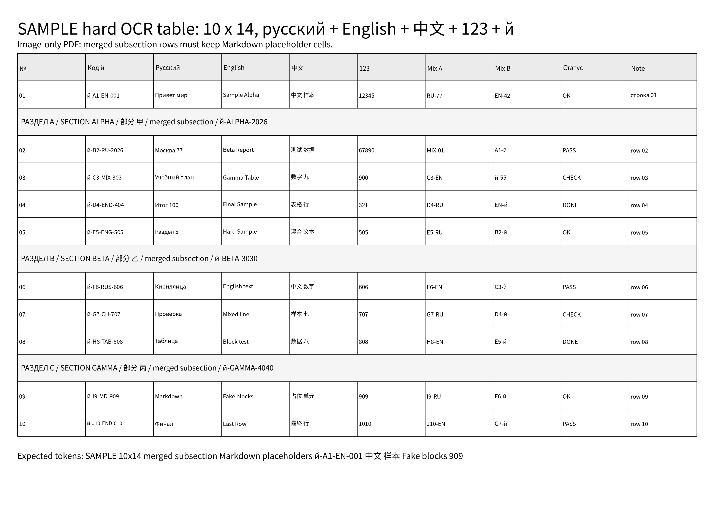

В примере raster имеет размер `3307×2339`. `01-aligned.png` совпадает с ним
побайтно: deskew не изменил страницу. Если они различаются, сначала проверьте,
не обрезал ли preprocess полезную область:

- [aligned RGB](./pipeline-example/01-aligned.png);
- [foreground mask](./pipeline-example/01-foreground-mask.png);
- [rule mask](./pipeline-example/01-rule-mask.png).

### 01 — geometry и разреженное владение

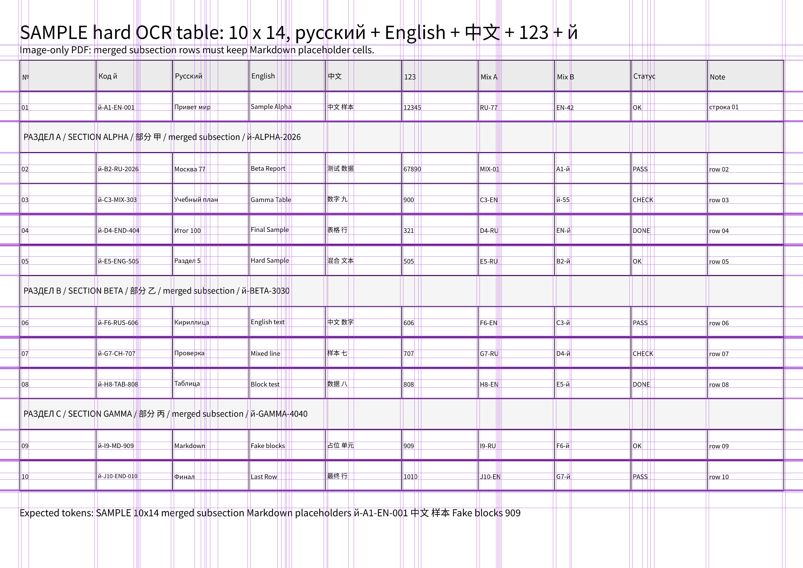

Фиолетовые линии — границы физических полуинтервалов, а не колонки
Markdown-таблицы. Для этого raster фактический `matrix.txt` начинается так:

```text
mode=pixel_partition
shape=108x58 nonzero=987
(0,1)  segment-000000
(0,2)  segment-000000
...
```

`shape=108x58` — число физических Y/X-интервалов. Сохраняются только 987
занятых координат; остальные координаты не превращаются в плотный массив.
Одинаковый `segment-N` в нескольких координатах означает одного владельца
foreground, а не несколько OCR-ячеек.

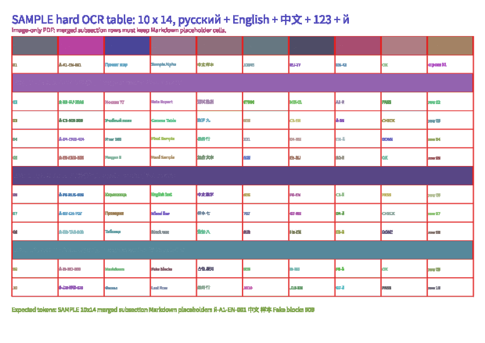

Цвет должен покрывать тот же glyph/line на всём bbox. Проверяйте
`segments.jsonl` по номеру, если цвет распался, захватил соседний текст или
исчез. Дополнительные виды:

- [recursive split overlay](./pipeline-example/01-recursive-overlay.png);
- [все segment bbox на странице](./pipeline-example/01-segments-overlay.png).

#### Все 202 segment crop

Каждая штатная contact sheet показывает `raw bbox | isolated ownership`.
Белая isolated-половина означает, что в bbox нет принадлежащего этому segment
foreground; это наблюдение, а не пропуск файла.

<details>
<summary>Открыть все девять contact sheet</summary>

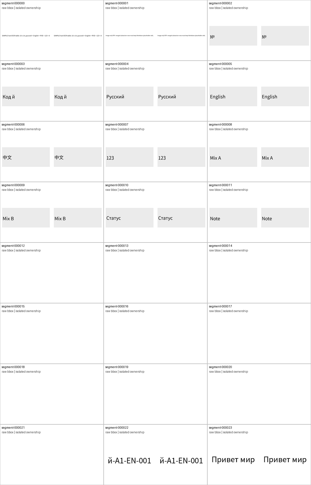

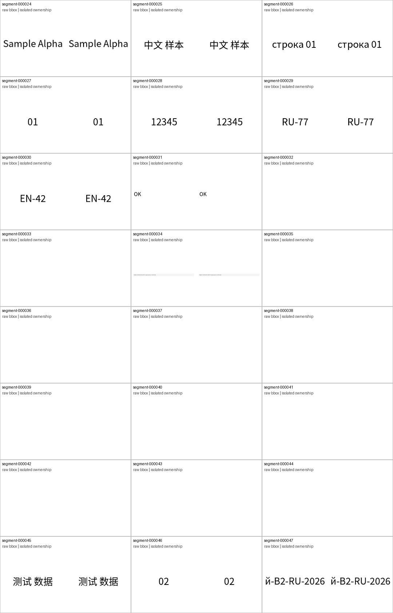

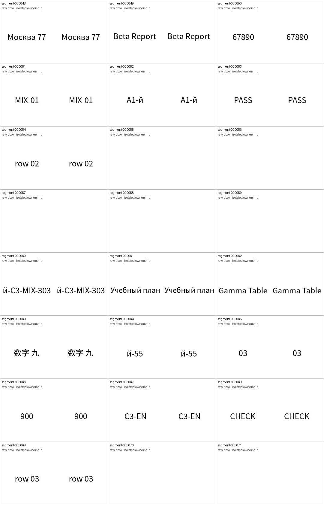

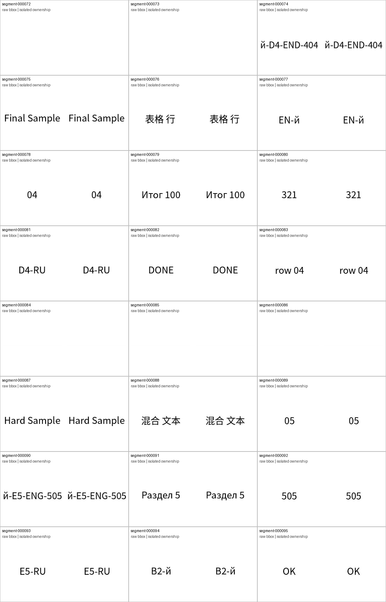

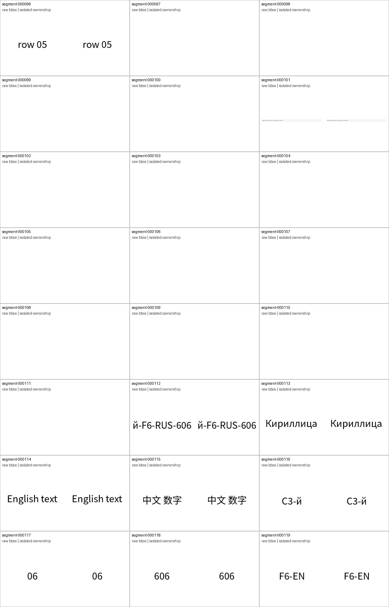

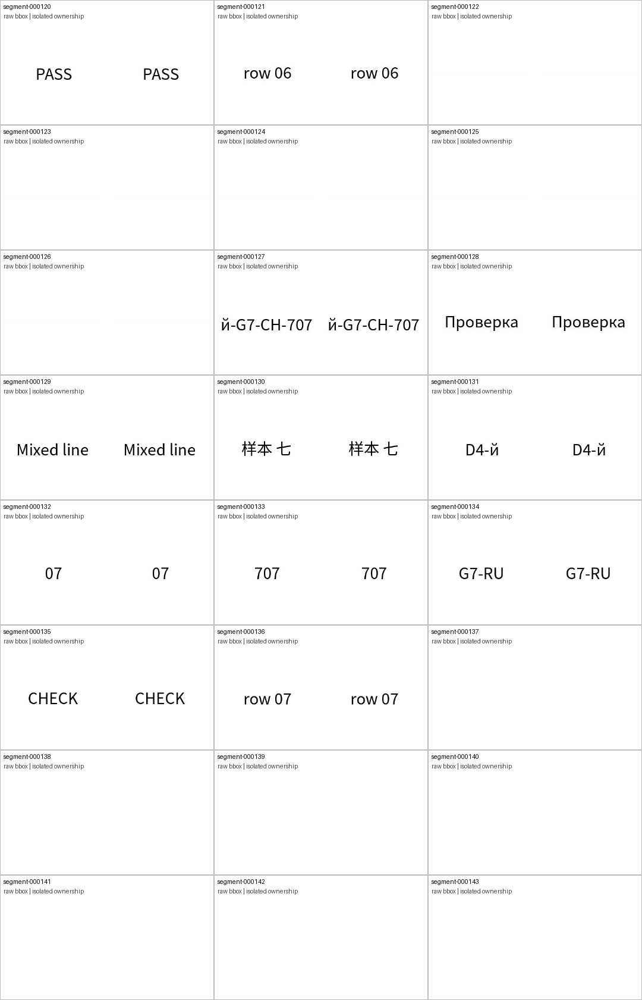

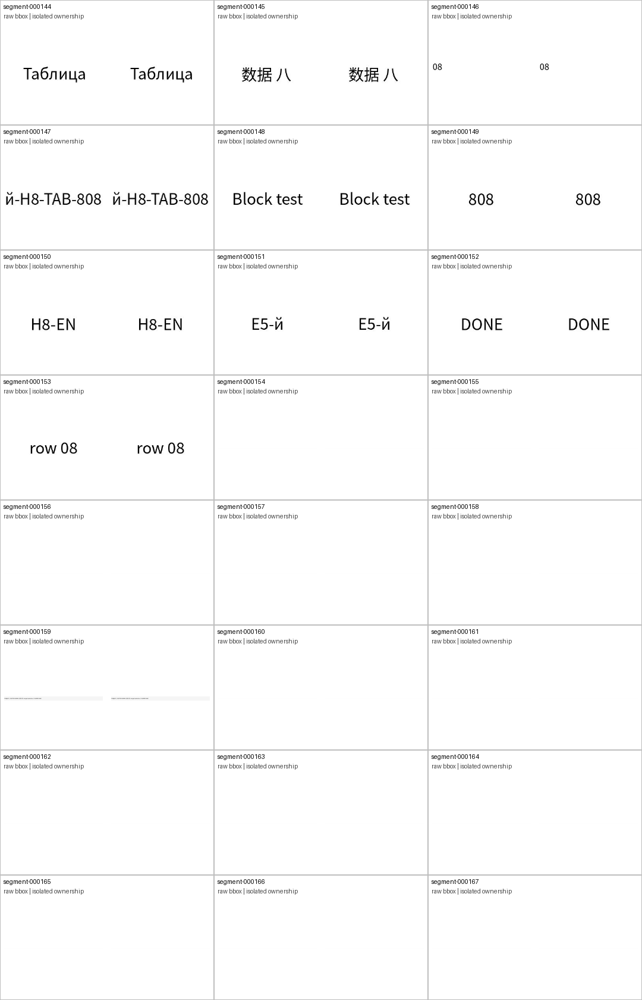

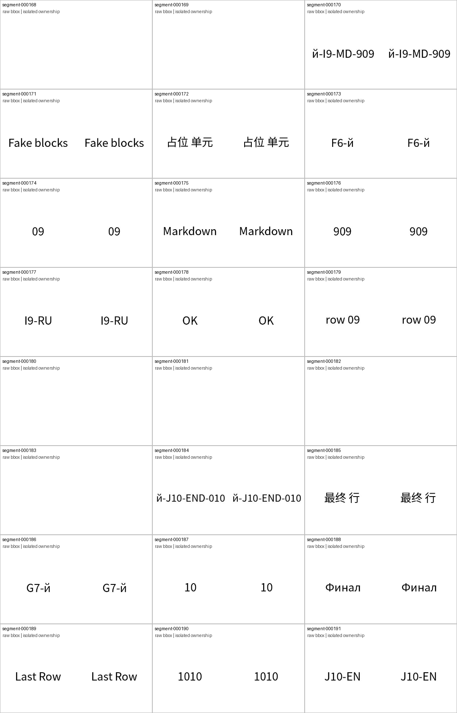

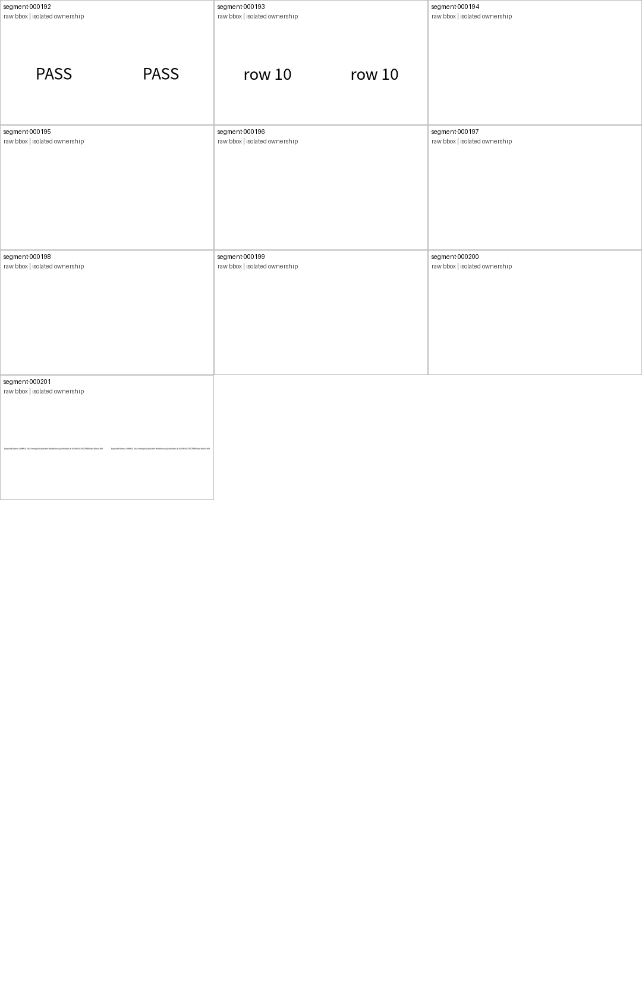

</details>

### 02 — canonical sparse topology

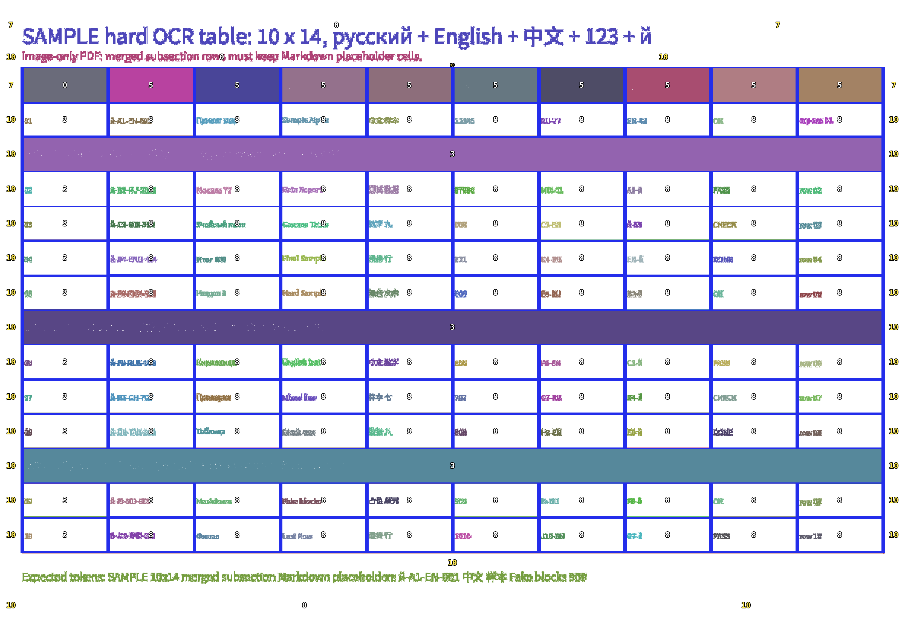

Topology — разреженная матрица физических областей. На изображении видно, что
текст над и под таблицей, края страницы, пустые полосы и ruled network имеют
разную ширину строк. Это не прямоугольная таблица.

Код складывается из независимых сигналов:

| Код    | Что наблюдено                                                     |
| ------ | ----------------------------------------------------------------- |
| `0`    | новый payload без продолжения сверху или слева                    |
| `3`    | тот же payload/empty-region продолжается сверху                   |
| `5`    | тот же non-empty payload продолжается слева                       |
| `8`    | `3 + 5`: продолжение сверху и слева                               |
| `7`    | явно обнаруженная конечная пустая область                         |
| `10`   | `7 + 3`: пустая область продолжается сверху                       |
| `null` | только хвост строки: повторить последний код до логической ширины |

`null` не является пустой ячейкой и недопустим в начале или середине
материализованной части строки. Источник истины для этой кодировки —
`ocr/app/sparse_pipeline/sparse_topology.py`; одноимённая layout-кодировка
другого runtime не должна подменять её.

Для проверки без PNG:

```bash
sed -n '1,120p' "$item/02-topology/sparse-topology-methodology.txt"
python3 -m json.tool \
  "$item/02-topology/sparse-topology-canonical.json" | sed -n '1,160p'
```

### 03 — reconstruction объектов

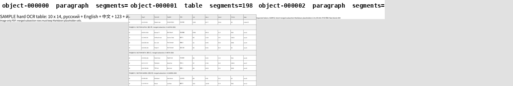

В текущем прогоне получены ровно три объекта:
`paragraph(2 segments)`, `table(198 segments)`, `paragraph(2 segments)`. Ниже
каждый объект прослежен отдельно через четыре состояния:

```text
03 object crop/ownership
  -> 04 block pixels и core/context membership
  -> 05 выбранный OCR output каждого block
  -> 06 выбранный текст segments
  -> 07 собранный текст object
```

Идентификаторы локальны своему каталогу. Для связи этапов используйте полный
ключ, а не голый `object_id` или `block_id`:

```text
<page object directory>/<policy>/<JSON block_id>/<OCR job_id>
```

В этом прогоне соответствие такое:

| Page object directory     | Stage 04 policy                | Stage 04 blocks | Stage 05 jobs | Stage 06 result               |
| ------------------------- | ------------------------------ | --------------- | ------------- | ----------------------------- |
| `object-000000-paragraph` | `line-windows`, `whole-object` | по 1 в policy   | по 1 в policy | 1 paragraph, segments 0–1     |
| `object-000001-table`     | `matrix-orxor`                 | 10              | 10            | 14 `table-row-*`              |
| `object-000002-paragraph` | `line-windows`, `whole-object` | по 1 в policy   | по 1 в policy | 1 paragraph, segments 200–201 |

Не соединяйте artifacts по полю `object_ids` внутри block JSON: в сохранённых
block-local scopes оно начинается заново и может содержать
`object-000000` даже внутри каталога page-object
`object-000001-table`. Внешний каталог page-object является владельцем.

Имя PNG Stage 04 использует 1-based номер (`block-000001...`), а поле
`block_id` в его JSON и OCR job используют 0-based номер (`block-000000`).
Ниже всегда показаны оба значения.

PNG ниже — сохранённый `raw`-crop Stage 04. Поле `transform` в JSON OCR job
показывает, какие pixels фактически распознавались: `raw` означает этот же
crop, `gamma` — его gamma-преобразованный вариант. Это варианты одного блока,
а не blocks разных объектов.

Локальная матрица table-object имеет 14 physical rows и 10 конечных segments в
каждой строке:

```text
0 5 5 5 5 5 5 5 5 5 null
3 8 8 8 8 8 8 8 8 8 null
3 8 8 8 8 8 8 8 8 8 null
...
```

Она доказывает связную двумерную topology объекта. Она не означает, что все
OCR cells объединены: строки, текст и Markdown placeholders появляются позже.

```bash
sed -n '1,100p' \
  "$item/03-find-object/objects/object-000001-table/matrix.txt"
python3 -m json.tool "$item/03-find-object/objects.json" | sed -n '1,200p'
```

### Object 000000 — верхний paragraph

Object crop:

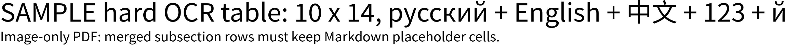

Ownership двух исходных segments:


Planner создал две стратегии. В этом sample их PNG побайтно совпадают, но обе
ветки существуют в artifacts:

`line-windows`:

Stage 04 `block-000001-segments-002-2299x134.raw.png` →
JSON `block_id=block-000000` → Stage 05 `ocr-job-00000000`,
`transform=raw`.


`whole-object`:

Stage 04 `block-000001-segments-002-2299x134.raw.png` →
JSON `block_id=block-000000` → Stage 05 `ocr-job-00000000`,
`transform=raw`.


Обе OCR jobs вернули:

```text
SAMPLE hard OCR table: 10 x 14, русский + English + FFX + 123 + й
Image-only PDF: merged subsection rows must keep Markdown placeholder cells.
```

Stage 06 связал текст с исходными segments:

```text
segment-000000+segment-000001
SAMPLE hard OCR table: 10 x 14, русский + English + FFX + 123 + й Image-only PDF: merged subsection rows must keep Markdown placeholder cells.
```

Stage 07 собрал из объекта один paragraph:

> SAMPLE hard OCR table: 10 x 14, русский + English + FFX + 123 + й
> Image-only PDF: merged subsection rows must keep Markdown placeholder cells.

Проверка artifacts:

```bash
sed -n '1,120p' \
  "$item/05-ocr-blocks/objects/object-000000-paragraph/line-windows/jobs/ocr-job-00000000.txt"
sed -n '1,120p' \
  "$item/06-get-segment/objects/object-000000-paragraph/line-windows/segments.txt"
sed -n '1,120p' \
  "$item/07-generate-object/objects/object-000000-paragraph/object-000000-paragraph.txt"
```

### Object 000001 — table

Object crop:

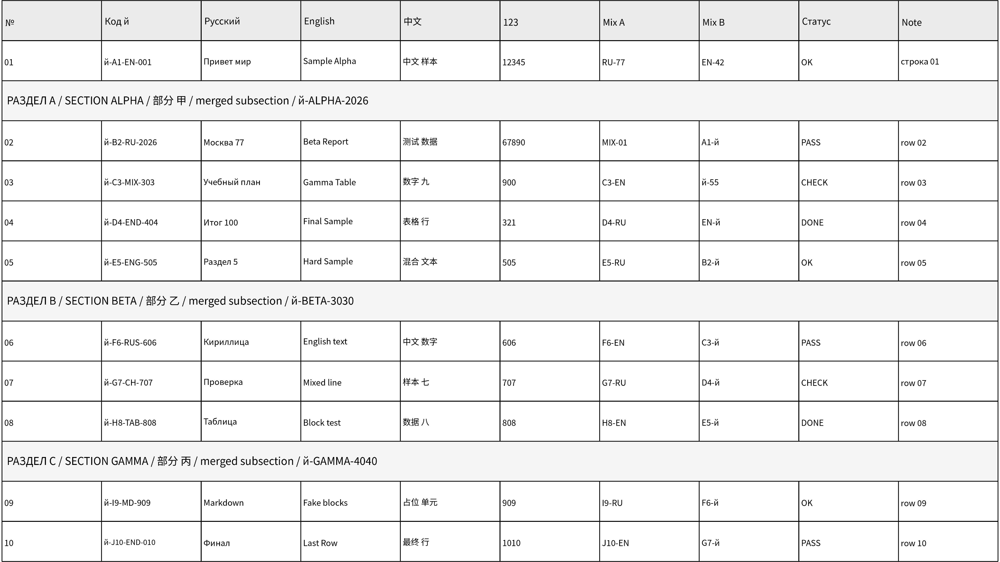

Ownership всех 198 исходных segments:

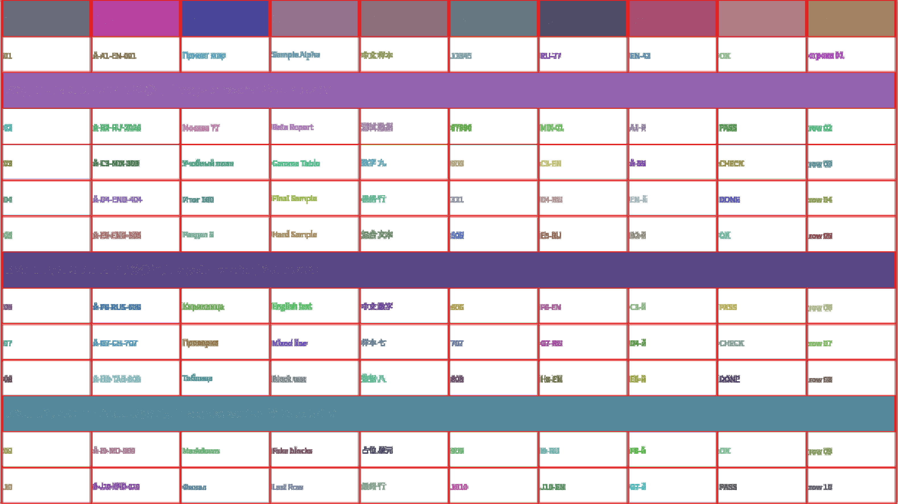

Один block здесь не равен строке или ячейке. `matrix-orxor` создал десять
перекрывающихся гипотез. `core` — segments, для которых эта гипотеза должна
дать основной evidence; `context` — соседние segments, добавленные для
распознавания в окружении.

<details>
<summary>Показать 10 blocks только для object-000001-table / matrix-orxor</summary>

#### `block-000001-segments-107-3134x1768.raw.png`

JSON `block_id=block-000000` → Stage 05 `ocr-job-00000000`,
`transform=gamma`.
`bbox=(12,3)-(3146,1771)`, `core=1`, `context=106`.

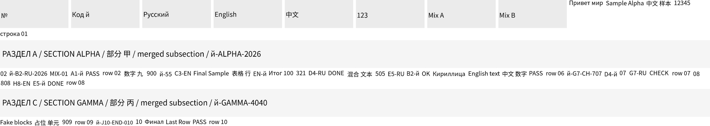

OCR job начинается так:

> Привет мир Sample Alpha ВУ; ЖЖ 12345 № Код i Русский English Хх 123 Mix A
> Mix B строка 01 РАЗДЕЛ А / SECTION ALPHA / #873 Е / merged subsection /
> И-АГРНА-2026 …

#### `block-000002-segments-104-3134x1768.raw.png`

JSON `block_id=block-000001` → Stage 05 `ocr-job-00000001`,
`transform=raw`.
`bbox=(12,3)-(3146,1771)`, `core=0`, `context=104`.

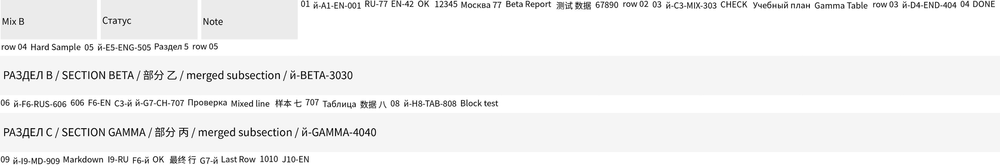

OCR job начинается так:

> 01 й-А1-Е№-001 RU-77 EN-42 ОК 12345 Москва 77 Beta Report 315 (#8 67890
> row 02 03 й-С3-МИХ-303 CHECK Учебный план Gamma Table …

`core=0` означает чистую context-гипотезу. Она может поддержать fusion, но не
владеет итоговым segment.

#### `block-000003-segments-093-3134x1641.raw.png`

JSON `block_id=block-000002` → Stage 05 `ocr-job-00000002`,
`transform=gamma`.
`bbox=(12,130)-(3146,1771)`, `core=1`, `context=92`.

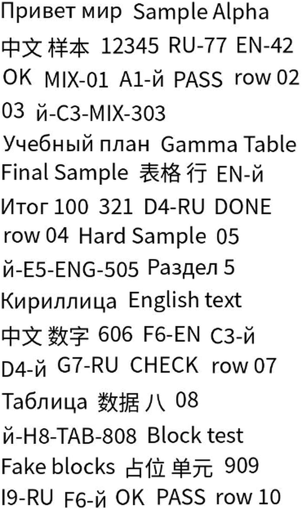

OCR job начинается так:

> Привет мир Sample Alpha Вх: ВЕ 12345 RU-77 EN-42 OK MIX-01 Al-i1 PASS
> row 02 03 11-C3-MIX-303 Учебный план Gamma Table …

#### `block-000004-segments-090-3134x1515.raw.png`

JSON `block_id=block-000003` → Stage 05 `ocr-job-00000003`,
`transform=raw`.
`bbox=(12,130)-(3146,1645)`, `core=2`, `context=88`.

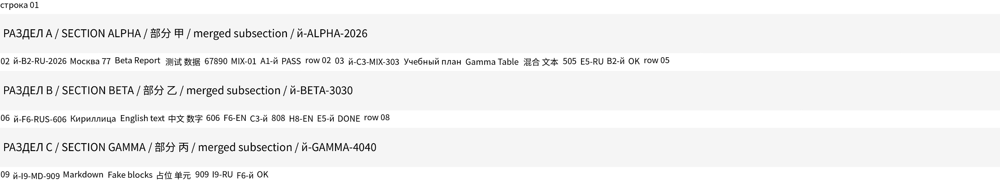

OCR job начинается так:

> строка 01 РАЗДЕЛ А / SECTION ALPHA / #83 Е / merged subsection /
> й-АГРНА-2026 02 й-В2-КМ-2026 Москва 77 Beta Report …

#### `block-000005-segments-078-3134x1261.raw.png`

JSON `block_id=block-000004` → Stage 05 `ocr-job-00000004`,
`transform=raw`.
`bbox=(12,510)-(3146,1771)`, `core=4`, `context=74`.

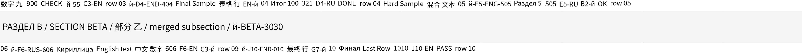

OCR job начинается так:

> #052 Hh 900 CHECK й-55 C3-EN row 03 i1-D4-END-404 Final Sample 25 17 Е№-й
> 04 Итог 100 321 D4-RU DONE row 04 …

#### `block-000006-segments-078-3134x754.raw.png`

JSON `block_id=block-000005` → Stage 05 `ocr-job-00000005`,
`transform=gamma`.
`bbox=(12,1017)-(3146,1771)`, `core=6`, `context=72`.

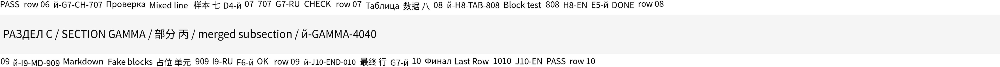

OCR job начинается так:

> PASS row 06 й-С7-СН-707 Проверка Mixed line #454 04-й 07 707 G7-RU
> CHECK row 07 Таблица #48 /\ 08 й-Н8-ТАВ-808 …

#### `block-000007-segments-092-3134x1768.raw.png`

JSON `block_id=block-000006` → Stage 05 `ocr-job-00000006`,
`transform=raw`.
`bbox=(12,3)-(3146,1771)`, `core=14`, `context=78`.

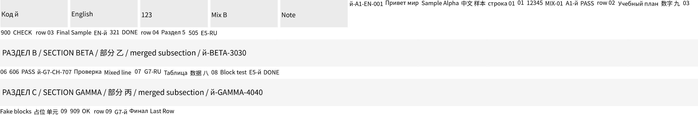

OCR job начинается так:

> й-А1-Е№-001 Привет мир Sample Alpha FIX #25 строка 01 01 12345 MIX-01
> А1-Й PASS row 02 Учебный план #52 Л, 03 …

#### `block-000008-segments-092-3134x1768.raw.png`

JSON `block_id=block-000007` → Stage 05 `ocr-job-00000007`,
`transform=gamma`.
`bbox=(12,3)-(3146,1771)`, `core=27`, `context=65`.

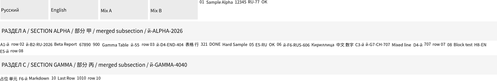

OCR job начинается так:

> 01 Sample Alpha 12345 RU-77 OK Русский English Mix A Mix B РАЗДЕЛ А /
> SECTION ALPHA / #873 Е / merged subsection / И-АГРНА-2026 …

#### `block-000009-segments-091-3134x1768.raw.png`

JSON `block_id=block-000008` → Stage 05 `ocr-job-00000008`,
`transform=gamma`.
`bbox=(12,3)-(3146,1771)`, `core=52`, `context=39`.

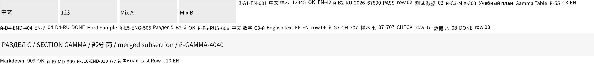

OCR job начинается так:

> й-А1-Е№-001 НРУ. 25 12345 ОК EN-42 11-B2-RU-2026 67890 PASS row 02
> 35 #432 02 й-С3-М1Х-303 Учебный план Gamma Table …

#### `block-000010-segments-091-3134x1768.raw.png`

JSON `block_id=block-000009` → Stage 05 `ocr-job-00000009`,
`transform=gamma`.
`bbox=(12,3)-(3146,1771)`, `core=91`, `context=0`.

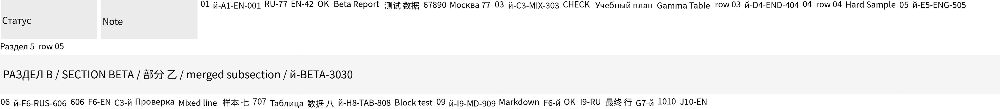

OCR job начинается так:

> 01 й-А1-Е№-001 RU-77 EN-42 OK Beta Report jist #0} 67890 Москва 77
> 03 14-C3-MIX-303 CHECK Учебный план Gamma Table row 03 …

Последняя гипотеза не содержит context: все её 91 segments являются core.
Полный raw OCR любой гипотезы читается в соответствующем
`05-ocr-blocks/.../jobs/ocr-job-*.txt`.

</details>

Stage 06 выбрал evidence из этих десяти OCR jobs и собрал следующие 14
текстовых segments. Это точное содержимое `segments.txt`:

```text
table-row-000000  №  Код й  Русский  English  RX  123  Mix A  Mix B  Статус  Note
table-row-000001  01  й-А1-Е№-001  Привет мир  Sample Alpha  25 17  12345  RU-77  EN-42  OK  строка 01
table-row-000002  РАЗДЕЛ А / SECTION  ALPHA / #873 Е /  merged subsection /  И-АГРНА-2026  #48 /\  67890  MIX-01  Е5-й  PASS  row 02
table-row-000003  02  BETA / #43 2, /  Москва 77  Beta Report  35 #432  67890  MIX-01  А1-Й  PASS  row 02
table-row-000004  03  11-F6-RUS-606  Учебный план  Gamma Table  #52 Л  900  C3-EN  й-55  CHECK  row 03
table-row-000005  04  n-E5-ENG-505  Раздел 5  Final Sample  21 {7  321  D4-RU  Е№-й  DONE  row 04
table-row-000006  05  BETA / #3 2, /  Раздел 5  Hard Sample  384 x7  505  E5-RU  В2-й  OK  row 05
table-row-000007  РАЗДЕЛ В / SECTION  BETA / #43 2, /  merged subsection /  English text  Ну; #3  606  F6-EN  С3-Й
table-row-000008  06  11-F6-RUS-606  Кириллица  English text  HX ЖЕЗР  606  F6-EN  СЗ-й  PASS  row 06
table-row-000009  07  й-Н8-ТАВ-808  Проверка  Mixed line  ЖЁЖ +  707  G7-RU  Е5-й  CHECK  row 07
table-row-000010  08  GAMMA / #8} № /  Таблица  Block test  #8 /\  808  Н8-ЕМ  Е5-й  DONE  row 08
table-row-000011  РАЗДЕЛ С / SECTION  GAMMA / 8843 Ву /  merged subsection /  n-GAMMA-4040  fi №5  909  19-RU  Е6-й  OK
table-row-000012  09  й-19-МО-909  Markdown  Fake blocks  51 Bt  909  19-RU  F6-i1  OK  row 09
table-row-000013  10  #-J10-END-010  Финал  Last Row  5% 17  1010  J10-EN  С7-й  PASS  row 10
```

Stage 07 превратил их в один table-object:

| №                  | Код й             | Русский             | English      | RX      | 123   | Mix A  | Mix B | Статус | Note      |
| ------------------ | ----------------- | ------------------- | ------------ | ------- | ----- | ------ | ----- | ------ | --------- |
| 01                 | й-А1-Е№-001       | Привет мир          | Sample Alpha | 25 17   | 12345 | RU-77  | EN-42 | OK     | строка 01 |
| РАЗДЕЛ А / SECTION | ALPHA / #873 Е /  | merged subsection / | И-АГРНА-2026 | #48 /\  | 67890 | MIX-01 | Е5-й  | PASS   | row 02    |
| 02                 | BETA / #43 2, /   | Москва 77           | Beta Report  | 35 #432 | 67890 | MIX-01 | А1-Й  | PASS   | row 02    |
| 03                 | 11-F6-RUS-606     | Учебный план        | Gamma Table  | #52 Л   | 900   | C3-EN  | й-55  | CHECK  | row 03    |
| 04                 | n-E5-ENG-505      | Раздел 5            | Final Sample | 21 {7   | 321   | D4-RU  | Е№-й  | DONE   | row 04    |
| 05                 | BETA / #3 2, /    | Раздел 5            | Hard Sample  | 384 x7  | 505   | E5-RU  | В2-й  | OK     | row 05    |
| РАЗДЕЛ В / SECTION | BETA / #43 2, /   | merged subsection / | English text | Ну; #3  | 606   | F6-EN  | С3-Й  |        |           |
| 06                 | 11-F6-RUS-606     | Кириллица           | English text | HX ЖЕЗР | 606   | F6-EN  | СЗ-й  | PASS   | row 06    |
| 07                 | й-Н8-ТАВ-808      | Проверка            | Mixed line   | ЖЁЖ +   | 707   | G7-RU  | Е5-й  | CHECK  | row 07    |
| 08                 | GAMMA / #8} № /   | Таблица             | Block test   | #8 /\   | 808   | Н8-ЕМ  | Е5-й  | DONE   | row 08    |
| РАЗДЕЛ С / SECTION | GAMMA / 8843 Ву / | merged subsection / | n-GAMMA-4040 | fi №5   | 909   | 19-RU  | Е6-й  | OK     |           |
| 09                 | й-19-МО-909       | Markdown            | Fake blocks  | 51 Bt   | 909   | 19-RU  | F6-i1 | OK     | row 09    |
| 10                 | #-J10-END-010     | Финал               | Last Row     | 5% 17   | 1010  | J10-EN | С7-й  | PASS   | row 10    |

Проверка полного raw OCR, выбранных segments и table-object:

```bash
for job in \
  "$item/05-ocr-blocks/objects/object-000001-table/matrix-orxor/jobs/"*.txt
do
  printf '\n===== %s =====\n' "${job##*/}"
  sed -n '1,160p' "$job"
done
sed -n '1,220p' \
  "$item/06-get-segment/objects/object-000001-table/matrix-orxor/segments.txt"
sed -n '1,220p' \
  "$item/07-generate-object/objects/object-000001-table/object-000001-table.txt"
```

### Object 000002 — нижний paragraph

Object crop:


Ownership двух исходных segments:


`line-windows`:

Stage 04 `block-000001-segments-002-3153x116.raw.png` →
JSON `block_id=block-000000` → Stage 05 `ocr-job-00000000`,
`transform=raw`.


`whole-object`:

Stage 04 `block-000001-segments-002-3153x116.raw.png` →
JSON `block_id=block-000000` → Stage 05 `ocr-job-00000000`,
`transform=raw`.


Обе OCR jobs вернули:

```text
Expected tokens: SAMPLE 10x14 merged subsection Markdown placeholders n-A1-EN-001 FFX ЖЕ25 Fake blocks 909
```

Stage 06 связал текст с исходными segments:

```text
segment-000200+segment-000201
Expected tokens: SAMPLE 10x14 merged subsection Markdown placeholders n-A1-EN-001 FFX ЖЕ25 Fake blocks 909
```

Stage 07 собрал один paragraph:

> Expected tokens: SAMPLE 10x14 merged subsection Markdown placeholders
> n-A1-EN-001 FFX ЖЕ25 Fake blocks 909

### Полный результат Stage 07

Stage 07 не распознаёт текст повторно. Он последовательно склеил:

```text
object-000000-paragraph
object-000001-table
object-000002-paragraph
```

Фактический собранный `result.md`:

> SAMPLE hard OCR table: 10 x 14, русский + English + FFX + 123 + й
> Image-only PDF: merged subsection rows must keep Markdown placeholder cells.

| №                  | Код й             | Русский             | English      | RX      | 123   | Mix A  | Mix B | Статус | Note      |
| ------------------ | ----------------- | ------------------- | ------------ | ------- | ----- | ------ | ----- | ------ | --------- |
| 01                 | й-А1-Е№-001       | Привет мир          | Sample Alpha | 25 17   | 12345 | RU-77  | EN-42 | OK     | строка 01 |
| РАЗДЕЛ А / SECTION | ALPHA / #873 Е /  | merged subsection / | И-АГРНА-2026 | #48 /\  | 67890 | MIX-01 | Е5-й  | PASS   | row 02    |
| 02                 | BETA / #43 2, /   | Москва 77           | Beta Report  | 35 #432 | 67890 | MIX-01 | А1-Й  | PASS   | row 02    |
| 03                 | 11-F6-RUS-606     | Учебный план        | Gamma Table  | #52 Л   | 900   | C3-EN  | й-55  | CHECK  | row 03    |
| 04                 | n-E5-ENG-505      | Раздел 5            | Final Sample | 21 {7   | 321   | D4-RU  | Е№-й  | DONE   | row 04    |
| 05                 | BETA / #3 2, /    | Раздел 5            | Hard Sample  | 384 x7  | 505   | E5-RU  | В2-й  | OK     | row 05    |
| РАЗДЕЛ В / SECTION | BETA / #43 2, /   | merged subsection / | English text | Ну; #3  | 606   | F6-EN  | С3-Й  |        |           |
| 06                 | 11-F6-RUS-606     | Кириллица           | English text | HX ЖЕЗР | 606   | F6-EN  | СЗ-й  | PASS   | row 06    |
| 07                 | й-Н8-ТАВ-808      | Проверка            | Mixed line   | ЖЁЖ +   | 707   | G7-RU  | Е5-й  | CHECK  | row 07    |
| 08                 | GAMMA / #8} № /   | Таблица             | Block test   | #8 /\   | 808   | Н8-ЕМ  | Е5-й  | DONE   | row 08    |
| РАЗДЕЛ С / SECTION | GAMMA / 8843 Ву / | merged subsection / | n-GAMMA-4040 | fi №5   | 909   | 19-RU  | Е6-й  | OK     |           |
| 09                 | й-19-МО-909       | Markdown            | Fake blocks  | 51 Bt   | 909   | 19-RU  | F6-i1 | OK     | row 09    |
| 10                 | #-J10-END-010     | Финал               | Last Row     | 5% 17   | 1010  | J10-EN | С7-й  | PASS   | row 10    |

> Expected tokens: SAMPLE 10x14 merged subsection Markdown placeholders
> n-A1-EN-001 FFX ЖЕ25 Fake blocks 909

Тот же result после Markdown-render:

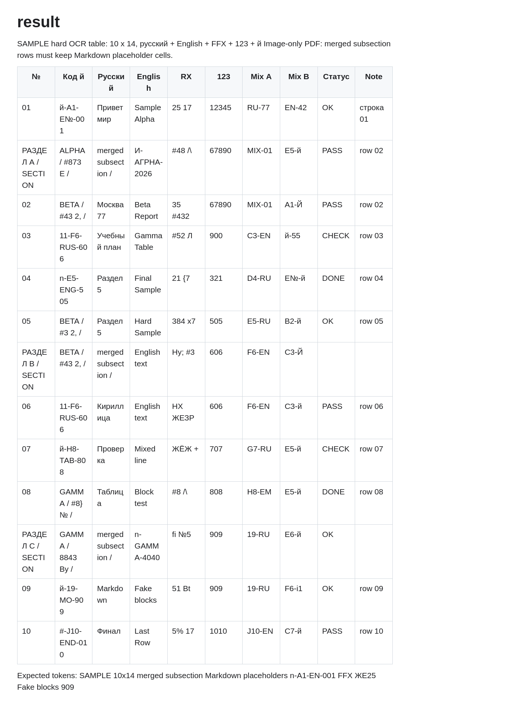

Структура сохранена: верхний paragraph, 10 колонок, 14 логических table rows и
нижний paragraph. Текст не является quality oracle: без `chi_sim` китайские
tokens и часть смешанных идентификаторов искажены, а точные glyphs могут
меняться вместе с версией Tesseract и traineddata.

```bash
sed -n '1,220p' "$item/07-generate-object/result.md"
find "$item/07-generate-object/objects" -type f -maxdepth 4 | sort
```

## Первая неверная граница

| Первая ошибка                        | Владелец причины                            |
| ------------------------------------ | ------------------------------------------- |
| `00-preprocess/raster.png`           | decode, PDF rasterization или preprocessing |
| `01-geometry/ownership.png`          | geometry segmentation/ownership             |
| `02-topology/ownership-topology.png` | physical sparse topology                    |
| `03-find-object/*`                   | object reconstruction/classification        |
| `04-separate-block/*`                | block planning, bbox или membership         |
| `05-ocr-blocks/jobs/*`               | OCR adapter, language или enhancement       |
| `06-get-segment/*`                   | evidence fusion/segment attribution         |
| `07-generate-object/result.md`       | document assembly/formatting                |

Диагностируйте первую ошибку, а не самый заметный downstream symptom.

## Остановить, продолжить, заменить одну границу

```bash
scripts/debug/debug-all-separated.sh \
  --fixture 'SAMPLE_4k.png' \
  --run-id geometry-check \
  --to-stage topology

scripts/debug/debug-all-separated.sh \
  --resume debug/tmp/debug-all-separated/geometry-check \
  --from-stage find-object

scripts/debug/debug-all-separated.sh \
  --resume debug/tmp/debug-all-separated/geometry-check \
  --only-stage topology \
  --replace-stage
```

`--input STAGE=PATH` подменяет вход одной границы известным artifact. Runner
фиксирует injection в `input.json` и `status.tsv`; такой запуск нельзя выдавать
за обычный end-to-end result.

## Benchmark — только при наличии reference

`debug-all.sh` сравнивает engines, но не объясняет structural stages:

```bash
scripts/debug/debug-all.sh \
  --engines tesseract \
  --fixture 'problem.png' \
  --expected-root /absolute/path/references \
  --tmp-root debug/tmp/incident-42-benchmark \
  --output-root debug/artifacts/incident-42
```

Reference должен называться как fixture с расширением `.md`. Значения
`missing_reference` и `n/a` означают отсутствие проверки; успешный exit code
такого прогона не доказывает качество OCR.

## Что приложить к инциденту

- команду, commit, время и exit code;
- `run.json`, `invocations.jsonl`, `status.tsv`;
- первый неверный artifact и его log;
- минимальный raster и ожидаемый фрагмент результата;
- для OCR — effective languages и соответствующий `jobs/*.json`;
- для service fault — task record и Compose logs по
  [операторскому runbook](../docs/ru/pipeline/README.md).

Скрипты с `legacy`, `version` или `v<number>` в имени проверяют замороженные
evidence contracts. Для нового инцидента используйте два entry point выше.
