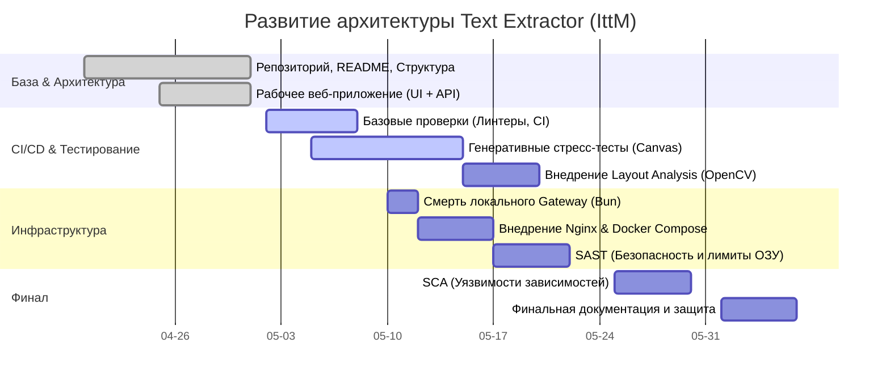

# Text Extractor (IttM)

Утилита рассчитывалась на то, чтобы «сожрать» длинный скриншот (например, корзину Amazon, чек или сложный учебный план с таблицами и сеткой расписания), полностью скопировать его содержимое и пересдать структуру нейросетевому агенту в чат в виде чистого Markdown.

# План развития проекта (По домашним заданиям)

В этом документе сопоставлены текущие проблемы кодовой базы с требованиями вашего курса и зафиксированы конкретные технические шаги для их решения, вплоть до оценки 10/10. Лирика и философские отступления убраны — только технический план.

## 🎯 Цель проекта и Стек

- **Суть:** Утилита рассчитывалась на то, чтобы «сожрать» длинный скриншот (корзину Amazon, чек, длинный лонгрид или огромный учебный план с сеткой расписания), выцепить оттуда весь текст вместе со структурой (таблицами, абзацами) и пересдать её нейросетевому агенту в чат в виде аккуратного Markdown.
- **Стек:** React 18 / TS / Tailwind. Бэкенд — Python (FastAPI, Tesseract/EasyOCR). Инфраструктура (план) — Nginx, Docker.

## 🚀 Roadmap (План развития)

## Таблица успеваемости и дедлайны

<table style="width:100%; border-collapse: collapse; margin-top: 12px;">
  <thead>
    <tr>
      <th style="padding: 12px; text-align: left; border: 1px solid rgba(0,0,0,0.2);">Задание</th>
      <th style="padding: 12px; text-align: left; border: 1px solid rgba(0,0,0,0.2);">Дедлайн</th>
      <th style="padding: 12px; text-align: left; border: 1px solid rgba(0,0,0,0.2);">4/10</th>
      <th style="padding: 12px; text-align: left; border: 1px solid rgba(0,0,0,0.2);">6/10</th>
      <th style="padding: 12px; text-align: left; border: 1px solid rgba(0,0,0,0.2);">8/10</th>
      <th style="padding: 12px; text-align: left; border: 1px solid rgba(0,0,0,0.2);">10/10</th>
    </tr>
  </thead>
  <tbody>
    <tr>
      <td style="background-color: #238636; color: white; padding: 12px; border: 1px solid rgba(0,0,0,0.2);">Репозиторий и описание проекта</td>
      <td style="background-color: #238636; color: white; padding: 12px; border: 1px solid rgba(0,0,0,0.2);">01.05.2026</td>
      <td style="background-color: #238636; color: white; padding: 12px; border: 1px solid rgba(0,0,0,0.2);">Есть репозиторий и README, но описание формальное/очень слабое</td>
      <td style="background-color: #238636; color: white; padding: 12px; border: 1px solid rgba(0,0,0,0.2);">Есть PR + README с понятной идеей проекта</td>
      <td style="padding: 12px; border: 1px solid rgba(0,0,0,0.2);">Есть ≥3 осмысленных комментария + студент отвечает на них</td>
      <td style="padding: 12px; border: 1px solid rgba(0,0,0,0.2);">README структурирован (цель, функционал, стек, планы), комментарии учтены и внесены правки</td>
    </tr>
    <tr>
      <td style="background-color: #238636; color: white; padding: 12px; border: 1px solid rgba(0,0,0,0.2);">Рабочее веб-приложение — UI + backend с REST API</td>
      <td style="background-color: #238636; color: white; padding: 12px; border: 1px solid rgba(0,0,0,0.2);">01.05.2026</td>
      <td style="background-color: #238636; color: white; padding: 12px; border: 1px solid rgba(0,0,0,0.2);">Код есть, но не запускается или не работает</td>
      <td style="background-color: #238636; color: white; padding: 12px; border: 1px solid rgba(0,0,0,0.2);">Приложение запускается и выполняет базовую функцию</td>
      <td style="background-color: #238636; color: white; padding: 12px; border: 1px solid rgba(0,0,0,0.2);">Код структурирован (разделение логики, читаемость)</td>
      <td style="background-color: #238636; color: white; padding: 12px; border: 1px solid rgba(0,0,0,0.2);">Есть инструкции запуска + обработка ошибок + минимальная архитектура</td>
    </tr>
    <tr>
      <td style="background-color: #238636; color: white; padding: 12px; border: 1px solid rgba(0,0,0,0.2);">CI и базовые проверки</td>
      <td style="background-color: #238636; color: white; padding: 12px; border: 1px solid rgba(0,0,0,0.2);">08.05.2026</td>
      <td style="background-color: #238636; color: white; padding: 12px; border: 1px solid rgba(0,0,0,0.2);">CI есть, но работает нестабильно</td>
      <td style="background-color: #238636; color: white; padding: 12px; border: 1px solid rgba(0,0,0,0.2);">CI запускается и выполняет хотя бы одну проверку</td>
      <td style="background-color: #238636; color: white; padding: 12px; border: 1px solid rgba(0,0,0,0.2);">Добавлены линтеры/форматирование</td>
      <td style="padding: 12px; border: 1px solid rgba(0,0,0,0.2);">CI блокирует merge при ошибках + понятная структура pipeline</td>
    </tr>
    <tr>
      <td style="padding: 12px; border: 1px solid rgba(0,0,0,0.2);">Контейнеризация</td>
      <td style="padding: 12px; border: 1px solid rgba(0,0,0,0.2);">15.05.2026</td>
      <td style="padding: 12px; border: 1px solid rgba(0,0,0,0.2);">Dockerfile есть, но не собирается</td>
      <td style="padding: 12px; border: 1px solid rgba(0,0,0,0.2);">Контейнер собирается и приложение запускается</td>
      <td style="padding: 12px; border: 1px solid rgba(0,0,0,0.2);">Корректная структура Dockerfile (слои, зависимости)</td>
      <td style="padding: 12px; border: 1px solid rgba(0,0,0,0.2);">Минимизированный образ + инструкции запуска</td>
    </tr>
    <tr>
      <td style="background-color: #238636; color: white; padding: 12px; border: 1px solid rgba(0,0,0,0.2);">Тестирование</td>
      <td style="background-color: #238636; color: white; padding: 12px; border: 1px solid rgba(0,0,0,0.2);">22.05.2026</td>
      <td style="background-color: #238636; color: white; padding: 12px; border: 1px solid rgba(0,0,0,0.2);">Тесты есть, но не работают</td>
      <td style="background-color: #238636; color: white; padding: 12px; border: 1px solid rgba(0,0,0,0.2);">Есть рабочие тесты</td>
      <td style="background-color: #d4a017; color: white; padding: 12px; border: 1px solid rgba(0,0,0,0.2);">Покрыт основной функционал</td>
      <td style="background-color: #d4a017; color: white; padding: 12px; border: 1px solid rgba(0,0,0,0.2);">Несколько типов тестов + интеграция в CI</td>
    </tr>
    <tr>
      <td style="padding: 12px; border: 1px solid rgba(0,0,0,0.2);">Статический анализ безопасности</td>
      <td style="padding: 12px; border: 1px solid rgba(0,0,0,0.2);">29.05.2026</td>
      <td style="padding: 12px; border: 1px solid rgba(0,0,0,0.2);">Инструмент подключен формально</td>
      <td style="padding: 12px; border: 1px solid rgba(0,0,0,0.2);">Анализ запускается и показывает результаты</td>
      <td style="padding: 12px; border: 1px solid rgba(0,0,0,0.2);">Найденные проблемы исправлены</td>
      <td style="padding: 12px; border: 1px solid rgba(0,0,0,0.2);">Интеграция в CI + осмысленный разбор issues</td>
    </tr>
    <tr>
      <td style="padding: 12px; border: 1px solid rgba(0,0,0,0.2);">Композиционный анализ (SCA)</td>
      <td style="padding: 12px; border: 1px solid rgba(0,0,0,0.2);">05.06.2026</td>
      <td style="padding: 12px; border: 1px solid rgba(0,0,0,0.2);">Инструмент запущен без понимания</td>
      <td style="padding: 12px; border: 1px solid rgba(0,0,0,0.2);">Получен SBOM или отчет</td>
      <td style="padding: 12px; border: 1px solid rgba(0,0,0,0.2);">Найдены и объяснены уязвимости</td>
      <td style="padding: 12px; border: 1px solid rgba(0,0,0,0.2);">Предложены или применены способы устранения</td>
    </tr>
    <tr>
      <td style="padding: 12px; border: 1px solid rgba(0,0,0,0.2);">Отчетность и документация</td>
      <td style="padding: 12px; border: 1px solid rgba(0,0,0,0.2);">05.06.2026</td>
      <td style="padding: 12px; border: 1px solid rgba(0,0,0,0.2);">Отчет есть, но поверхностный</td>
      <td style="padding: 12px; border: 1px solid rgba(0,0,0,0.2);">Описаны основные этапы разработки</td>
      <td style="padding: 12px; border: 1px solid rgba(0,0,0,0.2);">Структурированный документ с примерами</td>
      <td style="padding: 12px; border: 1px solid rgba(0,0,0,0.2);">Полноценная документация уровня «передать другому разработчику»</td>
    </tr>
  </tbody>
</table>

---

## План работ (сопоставление проблем с тасками)

### Домашка 1: Репозиторий и описание проекта

- **Текущее состояние:** Создан `ARCHITECTURE.md`, есть базовая Mermaid-схема.
- **План:** Добавить раздел Roadmap. Ответы на пулл-реквесты.

### Домашка 2: Ядро (Рабочее веб-приложение + архитектура OCR)

Это самый объемный пласт технических изменений.

**1. Проблема: "Слепое" разрезание картинок (`ocr/app/chunking/vertical.py`)**

- **[❌ Ожидает исправления] Внедрить `OpenCV`** (поиск контуров `cv2.findContours`) для определения границ таблиц и изолированного парсинга ячеек (Продвинутый Layout Analysis). На выходе должен собираться настоящий Markdown с синтаксисом таблиц (`| Предмет | Часы |`). Альтернативно: принудительное переключение на LLM.

**2. Проблема: Рефакторинг Frontend OCR ("Wall of Code" и Монолит)**

**Архитектурное решение по `App.tsx` и фронтенду:**

- **Единая навигационная область (Шапка + Боковая панель):** Шапка (`Header.tsx`) и боковая панель (`Sidebar.tsx`) объединяются в единую логическую область управления (`web/src/ui/layout/NavigationArea.tsx` или `ControlsLayout`). Они должны иметь общую логику и быть жестко связаны с выбором движка OCR через специальный файл-прокладку интерфейсов (например, `web/src/ui/layout/engine-controls.types.ts`). Это гарантирует предсказуемое управление стейтом движка.
- **Интерфейсы и Типы:** Вынос общих интерфейсов приложения в `web/src/types/app.types.ts`. Интерфейсы управления выбором движком лежат отдельно, связывая навигационную область и саму логику OCR.
- **Бизнес-логика (Main Content zone):** Рабочий стол (просмотр и загрузка изображений) вынесен в компонент `web/src/ui/workspace/OcrWorkspace.tsx`. `App.tsx` остается только "входным узлом", который подключает `OcrProvider` и `AppShell`.
- **Интерфейс провайдера стратегий:** Вся логика `use-extraction.ts` инкапсулируется так, чтобы `NavigationArea` взаимодействовала лишь с абстрактными контрактами (выбор движка, статус прогресса).

**3. Проблема: Управление трафиком (Edge / Локальный Gateway) и Vendor Lock-in**

- **[✅ Решено Частично]** Архитектура корректно разделена на Бэкенд и Gateway. Есть динамический поиск портов (fallback на свободные при конфликтах).
- **[❌ Ожидает исправления]** Убрать самописный шлюз на Node/Bun (`handle.ts`), который плохо раздает файлы, и перейти на классический `Nginx` внутри Docker. Он будет элегантно и быстро раздавать React-статику и проксировать `/api`. При выходе в интернет накрыть это `Cloudflare Workers`.

### Домашка 3: CI и базовые проверки

- **[❌ Ожидает исправления]** Настроить branch protection: документально запретить мержить в `main` код, не прошедший линтеры и тесты (требует настроек репозитория Github).

### Домашка 4: Контейнеризация

- **[✅ Решено Частично]** Скрипт-оркестратор `run.sh` пока существует как мощный комбайн (Выполняет роли пакетного менеджера, сборщика Vite и демона), но `ocr.Dockerfile` уже успешно собирается в CI (`tests.yml`).

**Рефакторинг `run.sh` и упрощение запуска:**

- Убрать из скрипта роли сборщика и пакетного менеджера.
- Перенести большую часть текущей локальной логики (установки `venv`, скачивание зависимостей `apt`, настройка портов, компиляция Node) в `docker-compose.yml`.
- Корневой `run.sh` обрезается до минимума и используется исключительно как точка входа для сборки и запуска Docker-контейнеров (`docker-compose up --build -d`). В финале запуск должен сводиться к однострочному вызову через `curl`.

- **[❌ Ожидает исправления]** Оптимизация слоев (Multi-stage builds), чтобы образ питона не весил 2 Гигабайта.
- **[❌ Ожидает исправления] Устранение хардкодов портов:** В `gateway/src/adapters/bun.ts`, `node.ts`, `docker-compose.yml` и `gateway/nginx.conf` порты жестко прописаны (`PORT || 3000`, `8000`). Все порты должны пробрасываться через переменные окружения.
- **[❌ Ожидает исправления]** Развертывание `docker-compose.yml`, где будут жить Nginx и Python Backend, полностью устранив сущности локального Bun/Node Gateway.

### Домашка 5: Тестирование

- **[❌ Ожидает исправления] Тесты на новые механики таблиц:** Навороченные механизмы `Layout Analysis` (разделение таблиц OpenCV внутри `ocr/app/chunking/vertical.py`) практически не покрыты негативными кейсами. Что делать, если подать пустой лист или фото с шумом?
- **[❌ Ожидает исправления]** Генеративное тестирование изображений (Стресс-тесты): Внедрить тесты, которые генерируют картинки разных форматов (с логарифмическим шагом по разрешению до панорам 10000x10000). Это отловит баги с падением `canvas` / Tesseract при ресайзе гигантских файлов.
- **[❌ Ожидает исправления] Тестирование Фронтенда ("Стена кода"):** Главная логика фронтенда (`use-extraction.ts` и `llm-client.ts`) не имеет Unit-тестов. Внедрить Vite Test + RTL.
- **[❌ Ожидает исправления] Тесты UI & Регресс:** Ни один UI компонент не защищен тестами — высокий риск регресса при изменении логики.

### Домашка 6: Статический анализ безопасности (SAST)

- Внедрить запуск SonarQube / Semgrep в Github Actions.
- Исправить все хардкоды таймаутов, небезопасные обработки файлов в памяти (защита от zip/image bomb — когда картинка весит 1КБ, но в ОЗУ разворачивается на 50ГБ).

### Домашка 7: Композиционный анализ (SCA)

- Настроить Dependabot в Github.
- Разобрать уязвимости старых пакетов в `npm` (фронтенд) и `requirements.txt` (бэкенд).
- Сделать Software Bill of Materials (SBOM) выгрузку в CI пайплайне при релизе.

### Домашка 8: Отчетность и документация

- **[❌ Ожидает исправления]** Финальная доделка `README.md` (добавление бейджиков CI, покрытие).
- **[❌ Ожидает исправления]** Описание развертывания проекта в Production-окружении (взаимодействие Cloudflare Edge -> Python Server).
- **[❌ Ожидает исправления]** Написание отчета по найденным уязвимостям на этапе SAST/SCA и методах их устранений.
