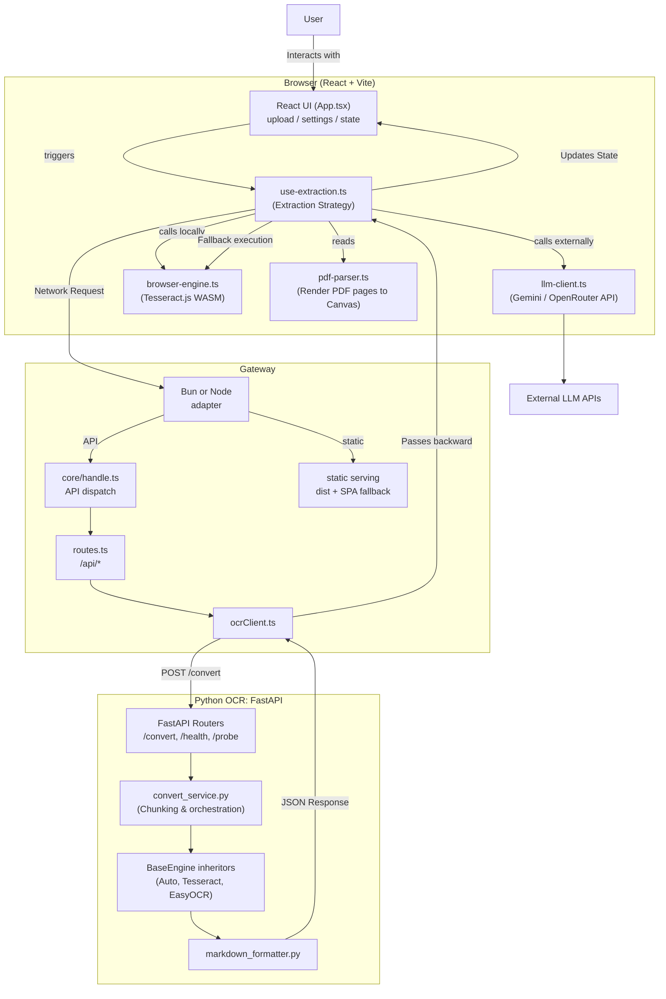

## Архитектура проекта

Архитектура держится на трех runtime-границах: браузер, gateway и Python OCR. Gateway - единственная публичная серверная точка входа; Python OCR спрятан за `OCR_URL`. `auto` - это политика выбора внутри UI, а не отдельный backend-компонент.



### Границы файлов

```text
web/src/
├─ App.tsx                  # тонкая точка сборки: OcrProvider + AppShell
├─ main.tsx                 # browser entrypoint
├─ index.css                # глобальные токены темы и layout
├─ types/app.types.ts       # общие типы приложения: состояние, тема, уведомления
├─ ui/AppShell.tsx          # root shell: drag/drop overlay, navigation, workspace
├─ ui/layout/NavigationArea.tsx
│                           # единая зона навигации: header + settings sidebar
├─ ui/layout/engine-controls.types.ts
│                           # контракт настроек OCR-движков для навигации
├─ ui/workspace/OcrWorkspace.tsx
│                           # рабочая область загрузки, настройки, чтения и прогресса
├─ ui/*                     # UI-поверхности: panels, sidebar, drag overlay, toast
├─ ui/sources.tsx           # описания OCR-источников для настроек и статусов
├─ ocr/OcrContext.tsx       # provider состояния приложения и действий OCR
├─ ocr/ocr-context.ts       # узкие context-контракты: shell, navigation, engine, workspace
├─ ocr/types.ts             # общие browser OCR/strategy типы
├─ ocr/use-extraction.ts    # выбор OCR-пути, fallback, cancel/resume, LLM/API/browser flow
├─ ocr/api-client.ts        # /api запросы, custom gateway URL, нормализация ошибок
├─ ocr/browser-engine.ts    # оркестрация browser OCR без глобального progress state
├─ ocr/browser-profile.ts   # профиль ресурсов: языки, лимиты изображения, render scale
├─ ocr/browser-image-preprocessor.ts
│                           # resize изображений, worker/OffscreenCanvas/main-thread fallback
├─ ocr/image-resize.worker.ts
│                           # тяжелый resize изображения вне main thread
├─ ocr/tesseract-worker-session.ts
│                           # lifecycle Tesseract.js worker lease/cache, isolated progress
├─ ocr/tesseract-recognize-input.ts
│                           # адаптер входа для Tesseract.js в browser/Node test runtime
├─ ocr/llm-client.ts        # прямые запросы Gemini/OpenRouter
├─ ocr/file-utils.ts        # проверка файлов, browser diagnostics, image helpers
├─ ocr/pdf-text.ts          # слияние native PDF text и OCR-слоя
├─ lib/pdf-parser.ts        # PDF.js: чтение текста, рендер страниц в Canvas
├─ lib/browser-ocr.ts       # совместимый re-export browser OCR API
└─ **/*.test.ts             # unit/browser OCR тесты рядом с проверяемым кодом
```

```text
gateway/src/
├─ adapters/bun.ts          # Bun runtime adapter + static fallback service
├─ adapters/node.ts         # Node runtime adapter + express.static для dist/
├─ domain/types.ts          # общие gateway-типы для API и OCR proxy
├─ core/handle.ts           # API-only dispatch, без файловой статики
├─ core/http.ts             # JSON/HTTP response helpers
├─ core/routes.ts           # /api/* маршруты
├─ services/staticFiles.ts  # Bun/static fallback, /IttM/ prefix, SPA fallback
├─ clients/ocrClient.ts     # proxy в Python OCR по OCR_URL
└─ **/*.test.ts             # unit-тесты adapter/core/static serving
```

```text
ocr/app/
├─ main.py                  # FastAPI app и подключение routers
├─ schemas.py               # Pydantic-модели ответов convert/probe/install
├─ routers/*                # health, diagnostics, convert, probe, install
├─ services/convert_service.py
│                           # загрузка файла, split/dedupe, выбор engine
├─ services/probe_service.py
│                           # проверка доступности Tesseract/EasyOCR и языковых пакетов
├─ engines/*                # OcrEngine, Tesseract, EasyOCR, Auto, Stub
├─ chunking/*               # разрезание длинных изображений и дедупликация
└─ formatting/*             # финальный Markdown
```

```text
CI/config:
├─ run.sh                   # локальный быстрый запуск: dist reuse, light deps, свободные порты
├─ scripts/debug.sh         # локальная проверка: npm/Python/Docker/act с опциональной очисткой
├─ .github/workflows/tests.yml
│                           # mandatory linters gate, Dockerized Python tests, OCR quality
├─ .github/workflows/static.yml
│                           # сборка и публикация GitHub Pages
├─ edge/cloudflare-worker.ts
│                           # edge adapter для статического frontend и API proxy
├─ eslint.config.js         # ESLint + Prettier plugin для web/gateway TS
├─ package.json             # npm scripts, frontend/gateway deps
├─ web/vite.config.ts       # Vite base path, aliases, build/test настройки
├─ web/tsconfig.json        # React TypeScript project config
├─ gateway/tsconfig.json    # Gateway TypeScript project config
├─ edge/tsconfig.json       # Cloudflare Worker TypeScript project config
├─ ocr/.flake8              # flake8 правила для Python OCR
├─ ocr/pyproject.toml       # Black/Ruff/isort конфигурация
├─ ocr/requirements-ci.txt  # Python CI deps: pytest, flake8, black, ruff
├─ ocr.Dockerfile           # стабильная OCR среда с Tesseract/lang packs/fonts
├─ gateway.Dockerfile       # production Node gateway image
├─ nginx.Dockerfile         # статическая раздача frontend через nginx
├─ gateway/nginx.conf       # SPA fallback и cache headers для nginx
└─ docker-compose.yml       # локальная связка gateway + OCR
```
