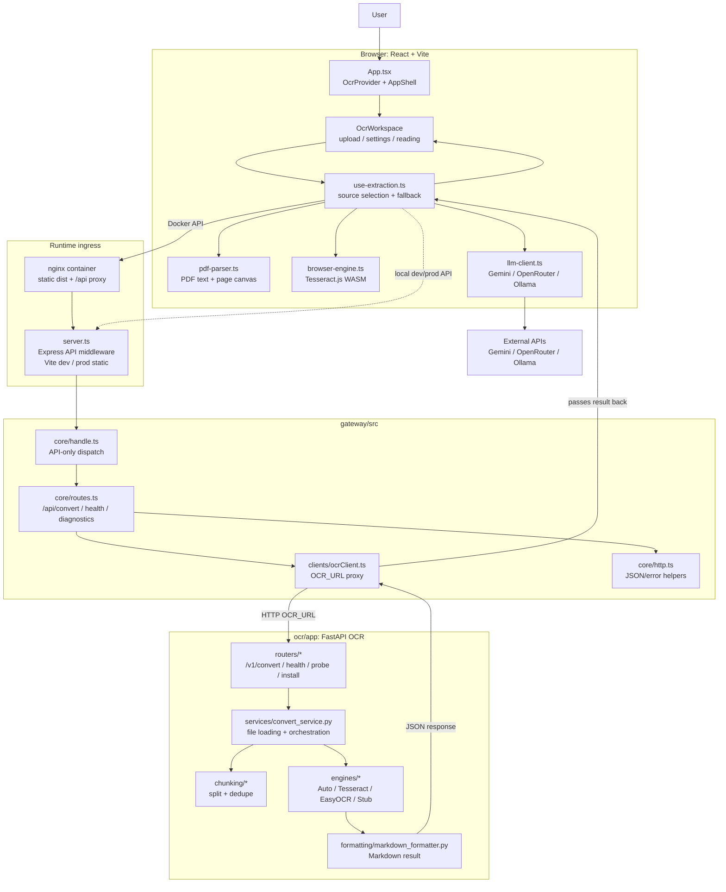

## Архитектура проекта

Архитектура держится на четырех границах: React UI, browser-side OCR/LLM стратегии, TypeScript gateway и Python OCR. В local/dev браузер ходит напрямую в `server.ts`; в Docker тот же API проходит через nginx, который раздает `dist/` и проксирует `/api/*` в gateway. Python OCR наружу не публикуется и доступен gateway только через `OCR_URL`.



<details>
<summary>Границы файлов</summary>

```text
web/src/
├─ App.tsx                  # корневой React component: OcrProvider + AppShell
├─ main.tsx                 # browser entrypoint
├─ index.css                # глобальные токены темы и layout
├─ types/app.types.ts       # общие типы состояния приложения
├─ ui/AppShell.tsx          # композиция header/sidebar/workspace
├─ ui/workspace/OcrWorkspace.tsx
│                           # рабочая область upload/loading/reading
├─ ui/layout/*              # навигационная зона и типы controls
├─ ui/*                     # UI-поверхности: header, panels, sidebar, drag overlay, toast
├─ ui/sources.tsx           # описания OCR-источников для настроек и статусов
├─ ocr/OcrContext.tsx       # верхний OCR state, diagnostics, настройки и actions
├─ ocr/ocr-context.ts       # React contexts для shell/workspace/controls
├─ ocr/types.ts             # общие browser OCR/strategy типы
├─ ocr/use-extraction.ts    # выбор OCR-пути, fallback, cancel/resume, LLM/API/browser flow
├─ ocr/api-client.ts        # /api запросы, custom gateway URL, нормализация ошибок
├─ ocr/browser-engine.ts    # оркестрация browser OCR без глобального progress state
├─ ocr/browser-profile.ts   # профиль ресурсов: языки, лимиты изображения, render scale
├─ ocr/browser-image-preprocessor.ts
│                           # resize изображений, worker/OffscreenCanvas/main-thread fallback
├─ ocr/image-resize.worker.ts
│                           # тяжелый resize изображения вне main thread
├─ ocr/tesseract-worker-session.ts
│                           # lifecycle Tesseract.js worker lease/cache, isolated progress
├─ ocr/tesseract-recognize-input.ts
│                           # адаптер входа для Tesseract.js в browser/Node test runtime
├─ ocr/llm-client.ts        # прямые запросы Gemini/OpenRouter/Ollama
├─ ocr/file-utils.ts        # проверка файлов, browser diagnostics, image helpers
├─ ocr/pdf-text.ts          # слияние native PDF text и OCR-слоя
├─ lib/pdf-parser.ts        # PDF.js: чтение текста, рендер страниц в Canvas
├─ lib/browser-ocr.ts       # совместимый re-export browser OCR API
└─ **/*.test.ts             # unit/browser OCR тесты рядом с проверяемым кодом
```

```text
gateway/
├─ nginx.conf               # nginx template для Docker gateway upstream
└─ src/
   ├─ domain/types.ts       # общие gateway-типы для API и OCR proxy
   ├─ core/handle.ts        # API-only dispatch, без файловой статики
   ├─ core/http.ts          # JSON/HTTP response helpers
   ├─ core/routes.ts        # /api/* маршруты
   ├─ services/staticFiles.ts
   │                        # static fallback, /IttM/ prefix, SPA fallback helpers
   ├─ clients/ocrClient.ts  # proxy в Python OCR по OCR_URL
   └─ **/*.test.ts          # unit-тесты core/static serving
```

```text
ocr/app/
├─ main.py                  # FastAPI app и подключение routers
├─ schemas.py               # Pydantic-модели ответов convert/probe/install
├─ routers/*                # health, diagnostics, convert, probe, install
├─ services/convert_service.py
│                           # загрузка файла, split/dedupe, выбор engine
├─ services/probe_service.py
│                           # проверка доступности Tesseract/EasyOCR и языковых пакетов
├─ engines/*                # OcrEngine, Tesseract, EasyOCR, Auto, Stub
├─ chunking/*               # разрезание длинных изображений и дедупликация
└─ formatting/*             # финальный Markdown
```

```text
CI/config:
├─ server.ts                # Node entrypoint: API middleware, Vite dev, prod static
├─ scripts/run-local.sh     # локальный запуск gateway + OCR через host/venv
├─ scripts/run-docker.sh    # Linux helper над docker compose
├─ scripts/build-lite.sh    # статическая Lite-сборка
├─ scripts/debug.sh         # локальная проверка npm/Python/Docker
├─ .github/workflows/tests.yml
│                           # linters, Dockerized Python tests, OCR quality
├─ .github/workflows/static.yml
│                           # сборка и публикация GitHub Pages
├─ edge/cloudflare-worker.ts
│                           # edge adapter для статического frontend и API proxy
├─ eslint.config.js         # ESLint + Prettier plugin для web/gateway TS
├─ package.json             # npm scripts, frontend/gateway deps
├─ web/vite.config.ts       # Vite base path, aliases, build настройки
├─ tsconfig.json            # TypeScript root config
├─ web/tsconfig.json        # TypeScript web config
├─ gateway/tsconfig.json    # TypeScript gateway config
├─ ocr/.flake8              # flake8 правила для Python OCR
├─ ocr/pyproject.toml       # Black/Ruff/isort конфигурация
├─ ocr/requirements-ci.txt  # Python CI deps: pytest, flake8, black, ruff
├─ docker/ocr.Dockerfile    # OCR среда с Tesseract/lang packs/fonts
├─ docker/gateway.Dockerfile
│                           # production Node gateway image
├─ docker/nginx.Dockerfile  # статическая раздача frontend через nginx
└─ docker-compose.yml       # nginx + gateway + OCR
```

</details>
