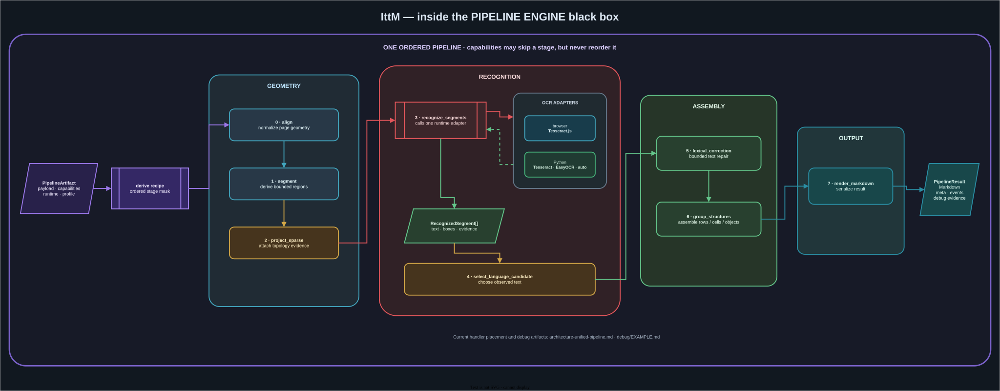

# Python OCR runtime

[Operator runbook](../ru/pipeline/README.md) |
[Full stage example](../../debug/EXAMPLE.md)

Public conversion routes call `ocr/app/services/convert_service.py`.
`ocr/app/sparse_pipeline` is a separate opt-in runtime and is not wired into
those routes.

Every raster page runs the native ABI 6 route `preprocess → geometry →
topology → find-object → separate-block → ocr-blocks → get-segment →
generate-object`. Python engines only implement `ocr-blocks`. A trustworthy
native PDF text layer is the only shortcut; `pdf_mode=raster` disables it.

Editable source: [`ocr-pipeline.drawio`](../assets/ocr-pipeline.drawio).

## Engines and default profiles

| `engine_type` | Default profile              |
| ------------- | ---------------------------- |
| `auto`        | `backend_auto_standard`      |
| `tesseract`   | `backend_tesseract_standard` |
| `easyocr`     | `backend_easyocr_standard`   |

`browser` is not a Python engine. The gateway rejects it for local tasks.

## Selectable profiles

| Profiles                                                                                   | Intended distinction                                      |
| ------------------------------------------------------------------------------------------ | --------------------------------------------------------- |
| `backend_auto_standard`, `backend_tesseract_standard`, `backend_easyocr_standard`          | normal engine defaults                                    |
| `backend_easyocr_table`, `backend_easyocr_spatial`                                         | fixed EasyOCR table or spatial layout                     |
| `backend_curriculum`, `backend_plain_text`, `backend_raw`                                  | specialized formatting, plain text, or minimal processing |
| `backend_auto_table_first`, `backend_tesseract_table_first`, `backend_easyocr_table_first` | table-first layout selection                              |
| `backend_tesseract_table_slots`, `backend_easyocr_table_slots`                             | line-merge table slots                                    |
| `backend_tesseract_recursive_slots`, `backend_easyocr_recursive_slots`                     | recursive-gap table slots                                 |
| `backend_tesseract_recursive_slots_t9`, `backend_easyocr_recursive_slots_t9`               | recursive slots plus small lexical/language retry         |
| `backend_tesseract_greek_math`                                                             | optional Greek/math language candidates                   |

Unknown explicit profile names return HTTP 400. `OCR_PIPELINE_PROFILES` in
`ocr/app/pipeline_config.py` is authoritative; this short list is checked by
`npm run test:pipeline-docs`.

Profiles may configure the selected OCR adapter (languages, retry and PSM), but
they do not select a second layout route: Rust owns raster segmentation and
assembly for every profile.

## Request controls

- `pdf_mode=auto` uses a trustworthy PDF text layer when possible and otherwise
  performs page OCR.
- `pdf_mode=raster` always renders and recognizes each page.
- Task routes accept `profile`/`pipeline_profile`; `request.profile` records
  the normalized value.
- Compatibility `/convert` routes additionally accept `pipeline_flags`; the
  task API does not forward that parameter.

Supported `pipeline_flags` overrides:

| Key                        | Values                                      |
| -------------------------- | ------------------------------------------- |
| `lexical_correction`       | `off`, `t9_small`                           |
| `ocr_language_retry`       | `off`, `t9_small`                           |
| `recursive_table_cell_ocr` | `off`, `auto`, `always`                     |
| `table_slot_builder`       | `off`, `line_merge_v1`, `recursive_gaps_v1` |
| `structural_output`        | `markdown`, `records`                       |

Syntax is `key:value` or `key=value`; separate entries with `;` or `,`.
Unknown keys or modes return HTTP 400.

## Effective values

Do not copy the full profile schema into documentation. The current Python
process exposes its supported overrides, profiles, and effective flags at
`GET /v1/pipeline/flags` inside the Compose network. The exact support command
and concise stage/topology meanings are in the
[operator runbook](../ru/pipeline/README.md).

The opt-in semantic stage order is documented in
[`sparse-pipeline.md`](./sparse-pipeline.md). Shared native/WASM predicates are
documented beside their code in
[`pipeline-core/README.md`](../../pipeline-core/README.md).
