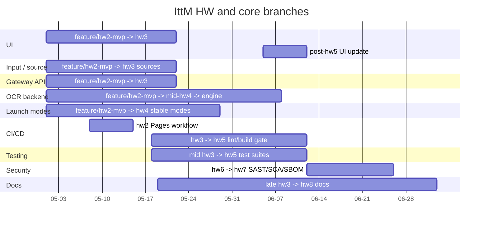
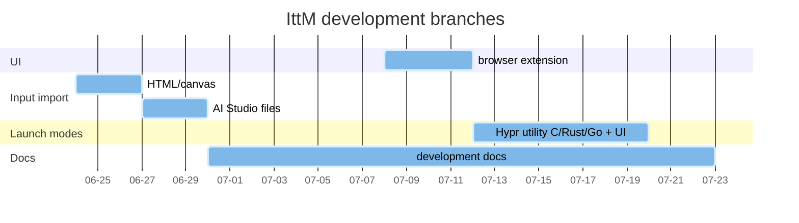

## Roadmap / История разработки курсового проекта

Ниже сохранены исторические диаграммы процесса разработки курса и планов (Roadmaps), которые иллюстрируют этапы ветвления (HW2, HW3, и т.д.):

Mermaid: HW and core branches

Mermaid: development branches

