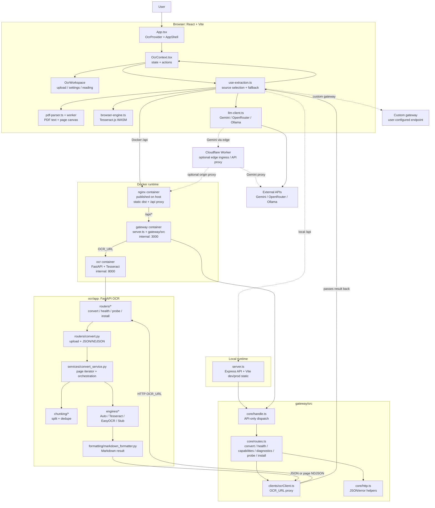

# Архитектура проекта

[Документация](./README.md) |
[Границы ответственности](./course/boundaries.md)

IttM — **gateway-first** инструмент: ядром является Extraction contract (gateway API), а браузерный интерфейс, CLI-обёртка и `curl` — равноправные клиенты над одним backend-ом. Архитектурно проект делится на браузерный клиент, браузерные стратегии распознавания, TypeScript gateway и Python OCR-сервис. Способ запуска (Docker / bare-metal / статическая сборка) и способ обращения к сервису (Web UI / `curl` / CLI) режимами обработки не являются — обработкой управляют четыре движка (Local Tesseract, Local EasyOCR, Browser OCR, External LLM).

При локальном запуске `server.ts` одновременно обслуживает API и frontend. В Docker-режиме наружу опубликован только nginx: он раздает собранный frontend и проксирует `/api/*` во внутренний gateway. Python OCR-сервис остается закрытым внутри runtime-сети и доступен gateway по `OCR_URL`.

Проверенное состояние runtime:

- в Docker наружу публикуется только nginx; host-порт выбирается автоматически из диапазона `3000-3099`, а фактический порт показывает `docker compose port nginx 80`;
- gateway и OCR остаются внутри Docker-сети;
- `GET /api/health` через nginx возвращает ответ Python OCR-сервиса;
- локальный запуск использует те же gateway-маршруты, что и контейнерный запуск;
- статическая Lite-сборка может работать без серверного OCR и использовать browser OCR или внешние LLM API.

Границы файлов и точки входа вынесены в отдельный документ:
[границы ответственности и точки входа](./course/boundaries.md).
