# Архитектура проекта

[Документация](./README.md) |
[Границы ответственности](./course/boundaries.md) |
[Целевой единый пайплайн](./architecture-unified-pipeline.md) |
[Текущая реализация флагов](./architecture-current-flags.md) |
[Ограничения](./architecture-limitations.md)

IttM — **gateway-first** инструмент. Ядро — Extraction contract (gateway API).
Web UI, CLI-обёртка и `curl` — равноправные клиенты над одним backend-ом.

Подробности о флагах/профилях вынесены в отдельные документы:

- [`architecture-unified-pipeline.md`](./architecture-unified-pipeline.md) — целевая модель единого пайплайна.
- [`architecture-current-flags.md`](./architecture-current-flags.md) — текущая реализация профилей/флагов.

## Запуск (launch) ≠ обработка (engines)

| Ось             | Значения                                                                                                                   |
| --------------- | -------------------------------------------------------------------------------------------------------------------------- |
| Запуск (launch) | Docker Compose, bare-metal (`bash scripts/runtime/run-local.sh`), статическая Lite (`bash scripts/runtime/build-lite.sh`). |
| Доступ (access) | Web UI, `curl`, CLI (`npm run extract -- --help`).                                                                         |

Это разные оси, не режимы OCR. Обработкой управляют **четыре движка**: Local Tesseract, Local EasyOCR, Browser OCR, External LLM. Запуск и доступ — лишь способ доставить им документ.

## Runtime-топология

Диаграмма показывает поток документа и границы ответственности: способы доступа
и запуска не являются OCR-режимами, browser orchestrator выбирает источник
обработки, gateway держит единый Extraction contract, а OCR/LLM-движки только
исполняют выбранную обработку.

В Docker наружу опубликован только nginx: он раздаёт собранный frontend и
проксирует `/api/*` во внутренний gateway. Python OCR-сервис остаётся закрытым
внутри runtime-сети и доступен gateway по `OCR_URL`.

В bare-metal-режиме `server.ts` одновременно обслуживает API и frontend на
одном gateway-порту.

## Shared contract (что уже работает)

Подмножество маршрутов, которые уже едины для Web UI, CLI и `curl`:

| Маршрут                                  | Метод    | Назначение                                                                                                                                  |
| ---------------------------------------- | -------- | ------------------------------------------------------------------------------------------------------------------------------------------- |
| `POST /api/extract/text`                 | POST     | Синхронное извлечение; формат по `Accept` (`text/plain`, `text/markdown`, `application/json`, `text/event-stream`, `application/x-ndjson`). |
| `POST /api/tasks`                        | POST     | Async-задача (`queued → running → ... → cancelled/partial/complete`).                                                                       |
| `GET  /api/tasks`                        | GET      | Список задач (`?state=&limit=&engine=&profile=`).                                                                                           |
| `GET  /api/tasks/:id`                    | GET      | Статус и результат задачи.                                                                                                                  |
| `GET  /api/tasks/:id/events`             | GET      | SSE-стрим прогресса; resume по `Last-Event-ID`.                                                                                             |
| `POST /api/tasks/:id/cancel`             | POST     | Отмена.                                                                                                                                     |
| `POST /convert`, `/convert/stream`       | POST     | Совместимые OCR-маршруты.                                                                                                                   |
| `GET  /api/health`                       | GET      | Проверка сервиса.                                                                                                                           |
| `GET  /api/capabilities`                 | GET      | Доступные движки, профили и лимиты.                                                                                                         |
| `GET  /api/diagnostics`                  | GET      | Диагностика окружения.                                                                                                                      |
| `POST /api/probe`                        | POST     | Тестовый прогон без сохранения.                                                                                                             |
| `GET  /v1/pipeline/flags`                | GET      | Каталог effective flag keys (общий для backend, browser, LLM).                                                                              |
| `POST /api/install-easyocr` (+`/status`) | POST/GET | Установка EasyOCR и её статус.                                                                                                              |

`pdf_mode=auto|raster` принимается в query (`?pdf_mode=...`), HTTP-header
(`X-PDF-Mode`), JSON-поле (`pdfMode`) и CLI-флаг (`--pdf-mode`). Неизвестные
значения → HTTP 400. Фактически использованный режим возвращается в
`meta.pdf_mode`.

In-memory task queue: `maxWorkers: 1`, `maxQueued: 32`. Задачи живут в памяти
процесса gateway и не переживают рестарт; durable queue, retry и retention
отсутствуют.

## Что где смотреть

| Тема                                          | Документ                                                                 |
| --------------------------------------------- | ------------------------------------------------------------------------ |
| Целевая модель единого пайплайна              | [`architecture-unified-pipeline.md`](./architecture-unified-pipeline.md) |
| Текущая реализация профилей/флагов            | [`architecture-current-flags.md`](./architecture-current-flags.md)       |
| Каталог профилей, табличные/OCR-флаги         | [`engine/README.md`](./engine/README.md)                                 |
| Жёсткие лимиты, причины и следствия           | [`architecture-limitations.md`](./architecture-limitations.md)           |
| Границы файлов и точки входа                  | [`course/boundaries.md`](./course/boundaries.md)                         |
| Направления развития (расширение, Linux, LLM) | [`roadmap/vision.md`](./roadmap/vision.md)                               |
