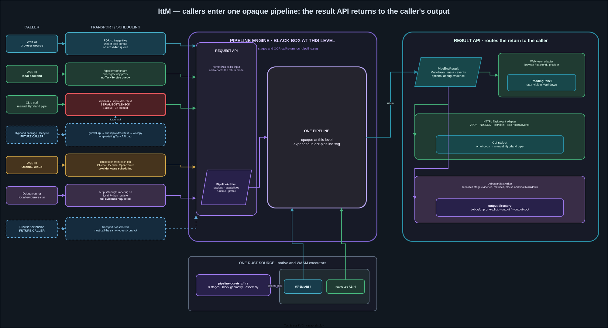

# Архитектура IttM

[Документация](./README.md) | [Диагностика pipeline](./pipeline/README.md) |
[Ограничения](./architecture-limitations.md) |
[Развитие](./roadmap/development-branches.md)

IttM имеет один логический pipeline contract и четыре пользовательских маршрута
входа: browser OCR, Web compatibility stream через локальный Python OCR, Task
API/CLI через тот же Python OCR и внешний provider. Локальный debug runner
вызывает тот же pipeline с запросом полного evidence, но возвращает результат
в каталог artifacts, а не в пользовательское окно. Способ запуска приложения
не является OCR engine.



Редактируемый источник:
[`project-architecture.drawio`](../assets/project-architecture.drawio).

На этой схеме pipeline намеренно показан black box. В него входят
`PipelineArtifact` и одна из двух сборок одного Rust source: WASM ABI 3 для
browser executor либо native `.so` ABI 3 для Python executor. Его подробная
под-схема: [этапы pipeline](./architecture-unified-pipeline.md) и
[`ocr-pipeline.drawio`](../assets/ocr-pipeline.drawio).

Точка входа определяет transport, scheduling, output adapter и runtime
capabilities входного artifact, но не владеет OCR engine. Tesseract.js и Python
Tesseract/EasyOCR вложены в этап `recognize_segments`: стадия вызывает adapter
с blocks/hints и получает обратно text/boxes/evidence без engine objects.

Markdown не является прямым результатом OCR engine. Pipeline принимает
recognition evidence, выполняет selection/fusion/grouping и формирует Markdown
на render boundary. `PipelineResult` затем идёт через Result API в
`ReadingPanel`, HTTP/CLI output либо debug artifact writer в зависимости от
caller. Trusted provider Markdown получает capabilities
`trustedText/providesLayout/providesMarkdown`, поэтому recipe пропускает
ненужные layout, correction и render handlers.

## Runtime-компоненты

| Компонент              | Фактическая ответственность                                               | Код или справочник                                                             |
| ---------------------- | ------------------------------------------------------------------------- | ------------------------------------------------------------------------------ |
| React Web UI           | Выбор source, browser workers, provider consent, показ Markdown           | [`web/src/ocr`](../../web/src/ocr)                                             |
| nginx                  | Статика и proxy `/api/*`, единственный опубликованный Compose service     | [`gateway/nginx.conf`](../../gateway/nginx.conf)                               |
| Gateway `server.ts`    | Fetch/Express adapter, compatibility routes и Task API                    | [Task API](../en/task-api.md)                                                  |
| Task API               | In-memory queue, records, events и cancellation                           | [`gateway/src/tasks`](../../gateway/src/tasks)                                 |
| Python FastAPI         | Upload guard, health и conversion routes                                  | [`ocr/app/routers`](../../ocr/app/routers)                                     |
| `convert_service.py`   | Текущий публичный PDF/image pipeline                                      | [Backend pipeline](../en/backend-pipeline.md)                                  |
| Tesseract / EasyOCR    | Платформенные OCR adapters                                                | [`ocr/app/engines`](../../ocr/app/engines)                                     |
| `pipeline-core` ABI 3  | Единые recipe/evidence/dedupe решения из одного Rust source               | [`pipeline-core/README.md`](../../pipeline-core/README.md)                     |
| `rust/ocr-core`        | Generated browser grammar WASM; production caller сейчас отсутствует      | [`web/src/ocr/grammar-assessment.ts`](../../web/src/ocr/grammar-assessment.ts) |
| Sparse pipeline        | Отдельный library/debug runtime; публичные routes его не создают          | [Sparse pipeline](../en/sparse-pipeline.md)                                    |
| External provider path | Gemini/OpenRouter после consent или явно настроенный локальный Ollama URL | [`web/src/ocr/llm-client.ts`](../../web/src/ocr/llm-client.ts)                 |

`rust/ocr-core` и `pipeline-core` — разные crates. Generated wrapper
`grammar-assessment.ts` вызывает первый, но текущий browser runtime этот wrapper
не импортирует. `pipeline-core` ABI 3, наоборот, реально собирается из одного
Rust source в native `.so` и WASM. Python и browser используют одинаковые
recipe и bounded решения, но исполняют decode, OCR и stage handlers своим
платформенным кодом.

## Где узкое место

- Task API намеренно ограничен `maxWorkers=1` и `maxQueued=32`: запросы
  `/api/tasks` и `/api/extract/text` сериализуются одним процессом gateway.
- Web compatibility route `/api/convert/stream` вызывает Python напрямую и
  обходит TaskService. Python запускает отдельный thread на каждый stream
  request; общего OCR semaphore в приложении нет.
- Browser worker pool существует только внутри JS realm вкладки. Две вкладки
  запускают независимые workers и конкурируют за CPU/RAM.
- Web UI вызывает настроенный Ollama URL напрямую из каждой вкладки. IttM не
  ставит эти запросы в очередь: итоговая параллельность зависит от Ollama.
- В полном debug sample распознавание блоков заняло около 78 секунд. Это
  вычислительное узкое место; Rust recipe/decision calls не являются OCR
  engine.
- Создание диагностических block PNG заняло около 69 секунд, но этот этап
  относится к debug artifacts и не входит в обычный публичный API path.

Команды и полный результат прогона:
[pipeline runbook](./pipeline/README.md) и
[debug sample](../../debug/EXAMPLE.md).

### Что произойдёт с двумя документами в двух вкладках

| Выбранный путь            | Поведение двух вкладок                                         |
| ------------------------- | -------------------------------------------------------------- |
| Browser OCR               | Два независимых пула; параллельная нагрузка на CPU/RAM клиента |
| Web local backend source  | Два Python stream thread; параллельная нагрузка на OCR backend |
| Task API или CLI          | Один running task, второй ждёт в gateway queue                 |
| Ollama / внешний provider | Два прямых запроса; планирование выполняет provider            |

Таким образом, UI не обязан зависнуть, но browser и compatibility backend paths
могут резко замедлиться из-за конкуренции за вычисления или память. Для
предсказуемой сериализации нужно использовать Task API.

## Локальный backend path

```text
nginx
  -> POST /api/convert/stream
     -> gateway compatibility route -> OcrClient
     -> Python /v1/convert/stream
  или
  -> POST /api/extract/text, POST /api/tasks
     -> in-memory TaskService -> OcrStreamTaskExecutor
     -> Python /v1/convert/stream
  -> upload/PDF guards
  -> convert_service
  -> Tesseract/EasyOCR + layout/formatting
  -> page/warning/complete events
  -> gateway result
```

Task API читает multipart или binary upload в `File` до вызова Python и хранит
этот `File` внутри in-memory task record. Наружу `GET /api/tasks/:id`
сериализует только имя, размер и media type, но память освобождается надёжно
только при завершении процесса gateway: eviction terminal records сейчас нет.

## Browser и provider paths

- Lite build показывает `browser`; при `auto` и отсутствии backend candidates
  он переключается на этот же путь. Backend build скрывает browser source.
- Browser OCR использует Tesseract.js, PDF/image workers, table/reviewer
  modules и `pipeline-core` WASM. Документ не отправляется в local gateway.
- Browser OCR не является Python engine и не принимает backend profile names.
- Gemini/OpenRouter требуют явного consent. Их result проходит browser text
  pipeline как уже предоставленный provider Markdown.
- Ollama вызывается прямым `fetch` из Web UI через явно настроенный URL, без
  gateway и TaskService. Он не является
  `engine_type=easyocr|tesseract|auto`.

CLI по умолчанию вызывает `/api/extract/text`, а stream mode — Task API с
fallback на совместимый `/api/convert/stream` только при `404/405`. Прямые
FastAPI `/v1/*` доступны внутри Compose network либо при отдельном локальном
запуске/публикации Python service. Optional edge worker проксирует `/api/*` в
настроенный origin и не входит в local Compose.

## Публичные маршруты

| Маршрут                                     | Назначение                                     |
| ------------------------------------------- | ---------------------------------------------- |
| `POST /api/convert[/stream]`                | Web compatibility JSON или NDJSON stream       |
| `POST /api/extract/text`                    | Синхронный plain-text task                     |
| `GET/POST /api/tasks`                       | Список records или создание task               |
| `GET /api/tasks/:id[/events]`               | Request, result и возобновляемые events        |
| `POST /api/tasks/:id/cancel`                | Отмена queued/running task                     |
| `GET /api/health`                           | Gateway → Python health                        |
| `GET /api/capabilities`, `/api/diagnostics` | Engines и runtime diagnostics                  |
| `POST /api/probe`                           | Выбранные backend probe cases                  |
| `/api/install-easyocr[/status]`             | Запуск и чтение состояния optional EasyOCR job |

Полный список routes, входов и состояний находится в
[Task API reference](../en/task-api.md). Команды сопровождения находятся в
[pipeline runbook](./pipeline/README.md).

## Что не подключено

`SparseConvertService` и `SparsePipelineRuntime` существуют в коде и
исполняются тестами/debug runner, но ни gateway, ни FastAPI router их не
создаёт. Их PNG, matrix и block artifacts нельзя ожидать от обычного
`/api/convert` или `/api/tasks` запроса. Условие будущего подключения
зафиксировано в [плане развития](./roadmap/development-branches.md).

Browser extension показан отдельным штрихованным входом: библиотеки
`web/src/extension-core` есть, но manifest/permissions/package отсутствуют и
его окончательный transport — browser, backend или provider — ещё не выбран.

Ручной Hyprland-вход уже работает как внешняя композиция
`grim/slurp → curl /api/extract/text → wl-copy` и попадает в текущий Task API.
Штрихован только будущий пакетированный вход: capture UI, scroll stitching и
desktop lifecycle. WASM для этого curl-маршрута не нужен.
