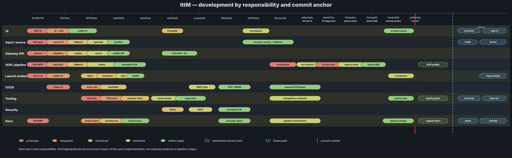

# Развитие IttM

[Текущее развитие](../roadmap/development-branches.md) |
[История](../roadmap/history.md) |
[Видение](../roadmap/vision.md)

Файл сохраняет стабильную ссылку из корневого README. Статус проекта больше не
ведётся отдельной текстовой диаграммой или по локальным названиям референсных
копий. История привязана к существующим commit objects, а текущая работа и
будущие направления разделены легендой SVG.

- Реализованное и проверенное: browser/backend OCR, Task API/CLI, recursive
  contracts, ABI 6 separated runtime, sparse opt-in runtime, SAST/SCA/SBOM gates.
- Текущая работа: документация сопровождения и проверяемые debug artifacts.
- Ближайшее развитие: lifecycle исходного `File`, versioned sparse artifacts,
  multilingual diagnostics и native/WASM parity.
- Будущее: public sparse profile, новые bounded inputs и browser extension.
- Далёкое будущее: полноценная Hyprland capture/clipboard integration и
  non-local deployment perimeter.

Критерии готовности и ограничения каждого пункта находятся в
[текущем плане](../roadmap/development-branches.md).
