# SAST

[Документация](./README.md) | [Политика безопасности](./security.md) |
[Тестирование](./testing.md)

SAST — это автоматическая проверка кода на опасные шаблоны до ревью и деплоя. В
проекте она работает как PR gate: если Semgrep находит запрещённый паттерн,
проверка падает и код нужно исправить или явно разобрать как ложное
срабатывание.

SAST не доказывает, что приложение безопасно полностью. Его задача проще и
практичнее: не пропускать в кодовую базу очевидные классы ошибок вроде wildcard
CORS, `eval`, небезопасного shell execution, XSS sinks и download-to-shell в
скриптах.

## Архитектура gate

Диаграмма фиксирует целевую release-архитектуру SAST-gate: от trust boundary
для PR и scheduled-прогонов до scope `SAST_TARGETS`, набора правил, изоляции
runner, исключений, артефактов, summary и blocking gate. Она описывает
контракт документации, а не снимок конкретного CI run.



SAST стоит рядом с companion gates: SCA/SBOM, secret scanning и runtime
contract tests. Эти слои не дублируют друг друга: Semgrep запрещает опасные
паттерны в коде и конфигурации, SCA отслеживает зависимости и container supply
chain, а runtime-тесты подтверждают поведение вроде CORS allowlist и защиты
static files от path traversal.

## Быстрый запуск

```bash
npm run test:sast
```

Команда запускает Semgrep через Docker. Локальная установка Semgrep не нужна, но
должен быть доступен Docker daemon.

Для точечной проверки можно ограничить пути:

```bash
SAST_TARGETS='web/src gateway/src edge/cloudflare-worker.ts' npm run test:sast
```

Локальные артефакты пишутся в `.sast/` и не коммитятся:

| Файл                  | Зачем нужен                                            |
| --------------------- | ------------------------------------------------------ |
| `.sast/semgrep.json`  | Полный машиночитаемый результат Semgrep                |
| `.sast/semgrep.sarif` | Формат для GitHub Code Scanning и внешних анализаторов |

## Где что лежит

| Путь                            | Роль                                                     |
| ------------------------------- | -------------------------------------------------------- |
| `.semgrep/sast.yml`             | Версионируемые правила Semgrep                           |
| `scripts/ci/run-sast.sh`        | Единая точка запуска локально и в GitHub Actions         |
| `scripts/ci/summarize-sast.mjs` | Markdown-summary для CI и локального вывода              |
| `.github/workflows/tests.yml`   | CI job, который запускает SAST и публикует артефакты     |
| `.sast/`                        | Runtime-результаты локального запуска; Git их игнорирует |

Docker-образ Semgrep закреплён по digest в `scripts/ci/run-sast.sh`. При
обновлении Semgrep меняется digest, затем заново прогоняются SAST, тесты и lint.

## Что сканируется

SAST проверяет production-код, инструменты разработчика и deployment-поверхность
проекта:

| Зона                    | Пути                                           | Что важно поймать                                     |
| ----------------------- | ---------------------------------------------- | ----------------------------------------------------- |
| Web UI                  | `web/src`                                      | XSS sinks, browser storage, worker/browser boundaries |
| Gateway API             | `gateway/src`, `server.ts`                     | proxy, upload streaming, backend fetch, task API      |
| Edge proxy              | `edge/cloudflare-worker.ts`                    | CORS, origin forwarding, external provider proxy      |
| Python OCR              | `ocr/app`                                      | FastAPI CORS, subprocess, temp files, deserialization |
| CI/runtime/CLI scripts  | `scripts/ci`, `scripts/runtime`, `scripts/cli` | shell injection, bootstrap commands, unsafe downloads |
| Container build surface | `docker`, `docker-compose.yml`                 | Dockerfile and Compose supply-chain anti-patterns     |
| GitHub Actions          | `.github/workflows`                            | download-to-shell and unsafe PR triggers              |
| Nginx reverse proxy     | `gateway/nginx.conf`                           | client-controlled upstreams                           |

Если появляется новая production-зона, публичный route, worker, runtime-скрипт
или Dockerfile, добавьте путь в `SAST_TARGETS` по умолчанию в
`scripts/ci/run-sast.sh`.

## Что НЕ сканируется

Список зон вне `SAST_TARGETS` с явной причиной. Это нужно знать до того, как
добавлять туда security-relevant код и считать, что он автоматически под gate.

| Зона                                        | Причина                                                                      |
| ------------------------------------------- | ---------------------------------------------------------------------------- |
| `scripts/benchmark/`                        | локальные measurement-скрипты, содержат heredoc-Python и нестабильный сигнал |
| `scripts/debug/`                            | ad-hoc диагностика, не часть прод-runtime                                    |
| `scripts/ollama-deploy/`                    | локальное развёртывание Ollama/совместимых OCR-моделей, своя модель угроз    |
| `scripts/cli/ittm-extract.ts`               | CLI-обёртка для разработчика, валидируется вручную                           |
| `ocr/tests/`                                | Python-тесты активно используют временные файлы и mocks; вне scope целиком   |
| `debug/`, `scripts/ollama-deploy/`, `.zoo/` | локальные debug/agent-пространства, не входят в релиз                        |

Если production-код требует похожий паттерн, не переносите его в test-only
исключение: добавьте безопасную обёртку или точечный `nosemgrep` с причиной.

## Что блокируется

| Класс риска                | Что делать вместо запрещённого паттерна                                                                                                 |
| -------------------------- | --------------------------------------------------------------------------------------------------------------------------------------- |
| Wildcard CORS              | Использовать явный allowlist origins и отдельные flags для специальных origins                                                          |
| Dynamic code execution     | Заменять `eval`/`exec`/`new Function` на parser, schema, lookup table или dispatcher                                                    |
| Shell execution            | Передавать argv массивом, избегать `shell=True`, `exec*` и строковых команд                                                             |
| Unsafe deserialization     | Использовать JSON, `yaml.safe_load` или строгую schema                                                                                  |
| Server fetch без timeout   | Передавать `AbortSignal` или ставить явный timeout через `AbortController`                                                              |
| XSS sinks                  | Рендерить через React/textContent; sanitizer допустим только с понятной политикой                                                       |
| Browser secret persistence | Не сохранять API keys/tokens/secrets в `localStorage`/`sessionStorage`                                                                  |
| TLS verification           | Не отключать `verify`; чинить CA/trust roots или явно настраивать trust store                                                           |
| Weak crypto/random         | Не использовать MD5/SHA1 и `random` для security tokens, nonce и integrity                                                              |
| Hardcoded secrets          | Читать keys/tokens/passwords из env или secret manager                                                                                  |
| Path traversal             | Пропускать filesystem input через `safeResolve`-style containment check                                                                 |
| Open redirect              | Выбирать redirect target из allowlist                                                                                                   |
| Shell/Docker supply chain  | Не передавать скачанное из сети прямо в shell; фиксировать версии и checksum                                                            |
| Compose privileges         | Не использовать `privileged`, host network, Docker socket mount или public bind                                                         |
| Workflow trigger RCE       | Semgrep ловит `pull_request_target` в `.github/workflows/*.yml`; допустимость оставшегося кейса решается security-review, а не правилом |

Правила намеренно ловят не все возможные security-баги, а те классы ошибок,
которые в этом проекте должны быть запрещены архитектурно.

## Как чинить finding

1. Откройте GitHub Actions summary или локальный `.sast/semgrep.json`.
2. Найдите `rule id`, файл и строку.
3. Исправьте код так, чтобы опасный паттерн исчез, а не был спрятан.
4. Если правило слишком широкое, сначала уточните правило в `.semgrep/sast.yml`.
5. Повторите проверку:

```bash
npm run test:sast
```

Для security-регрессий в поведении приложения добавляйте обычный тест рядом с
компонентом. Например, CORS-поведение edge worker проверяется в
`edge/cloudflare-worker.test.ts`, а CORS-поведение OCR backend — в
`ocr/tests/api/test_main.py`.

## Ложное срабатывание

`nosemgrep` допустим только когда одновременно верны все пункты:

- код действительно безопасен в текущем контексте;
- правило нельзя сузить без потери полезного покрытия;
- рядом с suppression есть короткая причина.

Предпочтительный порядок такой: исправить код, затем уточнить правило, и только
после этого точечно подавлять finding.

Некоторые зоны исключаются на уровне конкретных правил, чтобы fixtures не
размывали сигнал:

| Зона                                               | Почему исключается                                      |
| -------------------------------------------------- | ------------------------------------------------------- |
| `gateway/src/**/*.test.ts`                         | тестовые filesystem/fetch fixtures не являются runtime  |
| `web/src/**/*.test.ts`, `web/src/**/*.ocr-test.ts` | browser fixtures часто моделируют опасные sinks         |
| `ocr/tests/**`                                     | Python tests активно используют временные файлы и mocks |

Если production-код требует похожий паттерн, не переносите его в test-only
исключение: добавьте безопасную обёртку или точечный `nosemgrep` с причиной.

## Как добавлять правило

1. Добавьте правило в `.semgrep/sast.yml` с понятным `id`, `message`,
   `severity` и минимальным scope.
2. Укажите в `message`, что разработчик должен сделать вместо найденного
   паттерна.
3. Проверьте синтаксис правил:

```bash
docker run --rm -v "$PWD:/src" -w /src \
  semgrep/semgrep@sha256:c180f0c93a17b420c0af5006214a29d3c747c5459c732b740191adf657dd0068 \
  semgrep validate .semgrep/sast.yml
```

4. Запустите полный gate:

```bash
npm run test:sast
npm test
npm run lint
```

Если правило защищает конкретное поведение приложения, добавьте regression test
на это поведение. Semgrep должен ловить опасный паттерн, а обычный тест —
подтверждать runtime-контракт.

## CI и отчёты

В GitHub Actions SAST публикует:

- step summary с количеством findings и кратким списком правил;
- artifact `semgrep-sast` с JSON и SARIF.

Результат SAST зависит от конкретного commit и CI run, поэтому он хранится как
runtime-артефакт (`.sast/semgrep.json`, `.sast/semgrep.sarif`) и публикуется
через GitHub Actions. На постоянной основе Markdown-отчёт в `docs/` не
ведётся; ретроспективные сводки, если они понадобятся, оформляются отдельным
ad-hoc PR поверх конкретного CI run.

## Границы

SAST не заменяет:

- SCA/SBOM и CVE-проверку зависимостей;
- secret scanning истории Git;
- review архитектуры и модели угроз;
- runtime/integration тесты;
- pentest и проверку бизнес-логики.

Зависимости, SBOM и SCA описываются отдельно в [`sbom-report.md`](./sbom-report.md).
