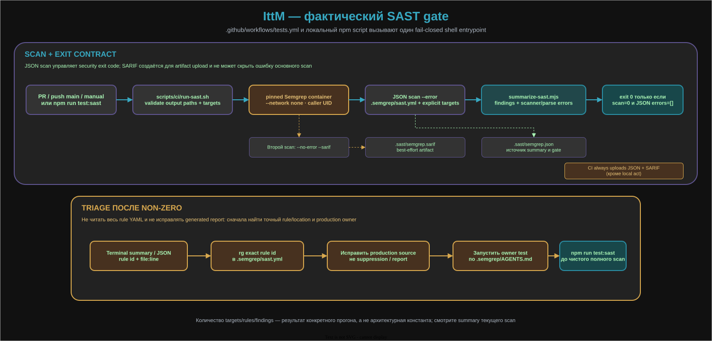

# SAST

[Security](./security.md) | [SCA/SBOM](./sbom-report.md)



Редактируемый источник:
[`sast-architecture.drawio`](../assets/sast-architecture.drawio).

## Запуск

```bash
npm run test:sast
```

Gate запускает pinned Semgrep container без сети, использует
`.semgrep/sast.yml` и targets из `scripts/ci/run-sast.sh`. Основной JSON scan
запускается с `--error`. Затем summary проверяет, что JSON читается и не
содержит scanner errors; если Semgrep завершился с `0`, ошибка summary меняет
итоговый status на non-zero. Отдельный SARIF scan использует `--no-error` и
является best effort, поэтому не определяет status gate.

Artifacts:

- `.sast/semgrep.json` — finding, rule id и точная строка;
- `.sast/semgrep.sarif` — CI upload;
- terminal/GitHub summary — краткое представление JSON.

## Диагностика

Сначала прочитайте rule id и source location из terminal/JSON, затем откройте
только соответствующее правило:

```bash
rg -n -C 10 "id: <exact-rule-id>" .semgrep/sast.yml
```

Исправьте production boundary и запустите отвечающий за него runtime test,
после чего повторите `npm run test:sast`. Полная карта таких тестов находится
в [`.semgrep/AGENTS.md`](../../.semgrep/AGENTS.md); файл написан по-английски
для AI agents и предотвращает чтение всего ruleset.

Suppression допустим только для доказанного false positive с короткой причиной
у строки и regression test. Изменение severity, исключение production path или
`nosemgrep` не являются исправлением finding.
