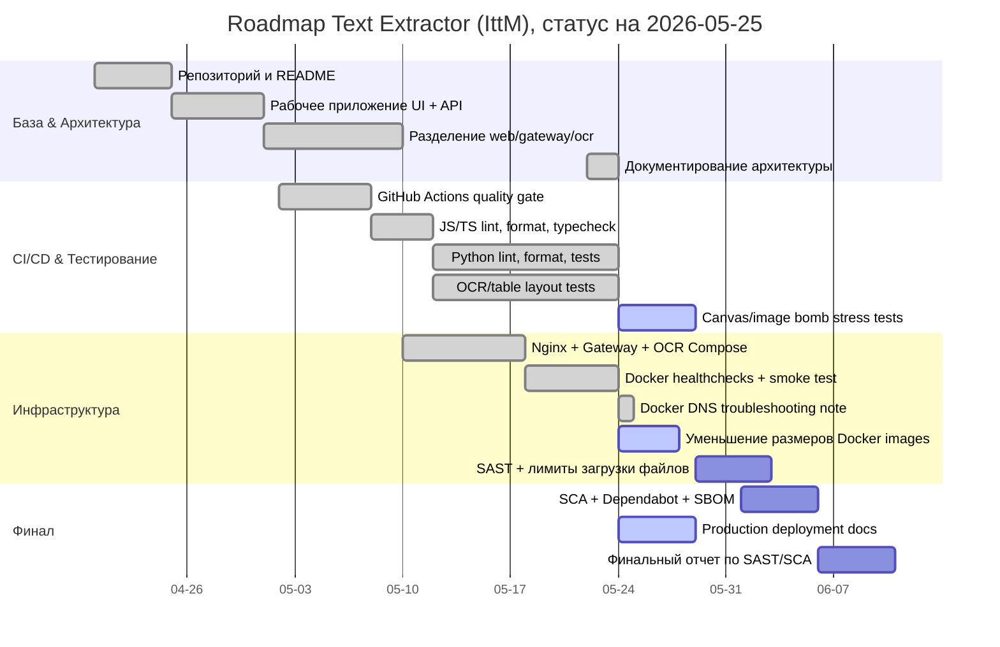

# Text Extractor (IttM)

## Контекст

Утилита рассчитывалась на то, чтобы «сожрать» длинный скриншот (например, корзину Amazon, чек или сложный учебный план с таблицами и сеткой расписания), полностью скопировать его содержимое и пересдать структуру нейросетевому агенту в чат в виде чистого Markdown.

**Стек:** React 19 / TypeScript / Tailwind. Gateway — Express (`server.ts`). OCR backend — Python (FastAPI, Tesseract/EasyOCR). Инфраструктура — Nginx и Docker Compose.

## План работ по курсу

## План работ (сопоставление проблем с тасками)

Ниже только незакрытые пункты. Временная таблица дедлайнов и критериев хранится в `docs/tmp/course_tasks.md`.

### Домашка 3: CI и базовые проверки

- **[❌ Ожидает настройки в GitHub]** Включить branch protection для `main`: запретить merge без успешных checks из `.github/workflows/tests.yml`.

### Домашка 4: Контейнеризация

- **[✅ Проверено]** Контейнерный запуск идет через `docker compose up -d`; фактический адрес nginx смотрится командой `docker compose port nginx 80`.
- **[⚠️ Зафиксировано]** В текущей среде `docker compose build` может падать на DNS внутри Docker build network (`Temporary failure resolving 'deb.debian.org'`). В `README.md` оставлена короткая заметка про перезапуск Docker daemon.
- **[⚠️ Требует оптимизации для 10/10]** Фактические размеры образов: `ittm-ocr` ~1.18 GB, `ittm-gateway` ~612 MB, `ittm-nginx` ~137 MB, `ittm-ocr-ci` ~1.25 GB.

### Домашка 5: Тестирование

- **[❌ Ожидает исправления]** Генеративное тестирование изображений (Стресс-тесты): Внедрить тесты, которые генерируют картинки разных форматов (с логарифмическим шагом по разрешению до панорам 10000x10000). Это отловит баги с падением `canvas` / Tesseract при ресайзе гигантских файлов.
- **[❌ Ожидает исправления] Тестирование Фронтенда ("Стена кода"):** Главная логика фронтенда (`use-extraction.ts` и `llm-client.ts`) не имеет Unit-тестов. Внедрить Vite Test + RTL.
- **[❌ Ожидает исправления] Тесты UI & Регресс:** Ни один UI компонент не защищен тестами — высокий риск регресса при изменении логики.

### Домашка 6: Статический анализ безопасности (SAST)

- Внедрить запуск SonarQube / Semgrep в Github Actions.
- Исправить все хардкоды таймаутов, небезопасные обработки файлов в памяти (защита от zip/image bomb — когда картинка весит 1КБ, но в ОЗУ разворачивается на 50ГБ).

### Домашка 7: Композиционный анализ (SCA)

- Настроить Dependabot в Github.
- Разобрать уязвимости старых пакетов в `npm` (фронтенд) и `requirements.txt` (бэкенд).
- Сделать Software Bill of Materials (SBOM) выгрузку в CI пайплайне при релизе.

### Домашка 8: Отчетность и документация

- **[❌ Ожидает исправления]** Финальная доделка `README.md` (добавление бейджиков CI, покрытие).
- **[❌ Ожидает исправления]** Описание развертывания проекта в Production-окружении (взаимодействие Cloudflare Edge -> Python Server).
- **[❌ Ожидает исправления]** Написание отчета по найденным уязвимостям на этапе SAST/SCA и методах их устранений.

## NB

# добавить поддержжку вытягивание текста из html (canvas внутри чат бота)

# добавить поддержку файлов из google AI studio

# сделать расширением браузера вместо fish ocr

# сделать совместимым с dot hyprland (вместо текущего ctrl+sift+A для обращения к гугл линзе)
